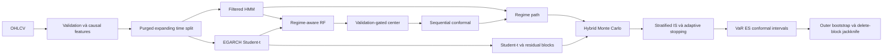
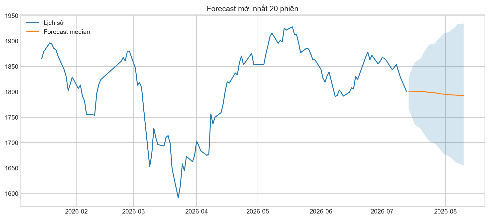
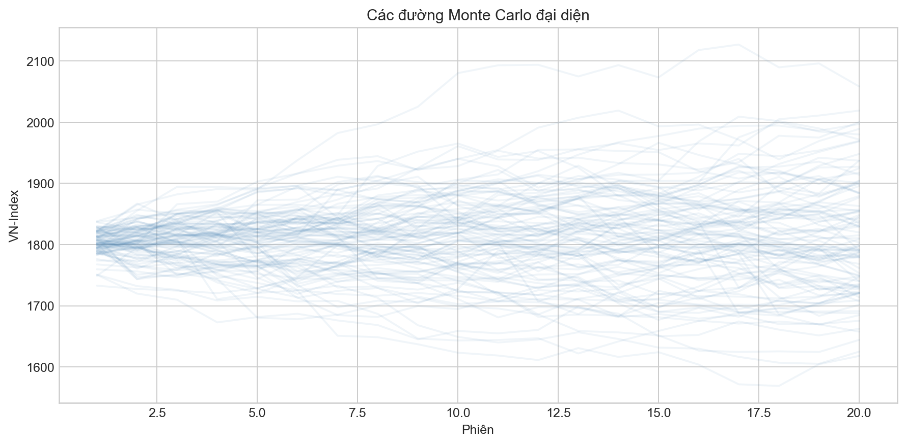
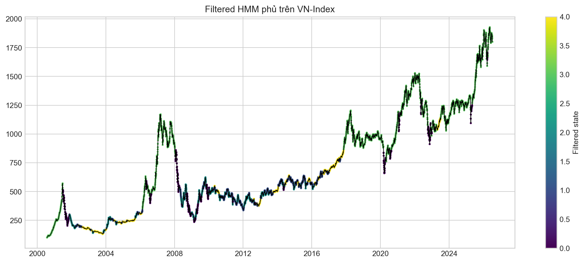
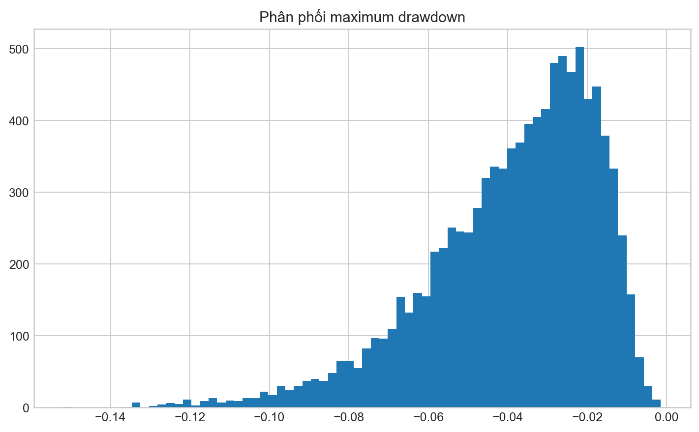

# VN-Index Regime-Aware Random Forest và Hybrid Monte Carlo

Tác giả: **Nguyễn Hoài Nam**

Pipeline nghiên cứu tái lập để dự báo lợi suất, mức điểm, trạng thái Bull/Sideway/Bear/Stress và phân phối rủi ro VN-Index. Kiến trúc giữ Filtered HMM, EGARCH Student-t và regime-aware Random Forest, đồng thời thêm validation-gated distribution center, sequential conformal, stratified/importance sampling, adaptive Monte Carlo, outer stationary bootstrap và delete-block jackknife.

> Đây là nghiên cứu định lượng, không phải khuyến nghị đầu tư.

## Dữ liệu

Tệp `data/raw/VNINDEX_Daily.csv` có 6,306 phiên từ 2000-07-28 đến 2026-07-13. CSV nguồn có dấu phẩy hàng nghìn không được quote; parser phục hồi OHLCV và xác minh High/Low. Pipeline không nội suy close qua ngày thiếu.

## Kiến trúc



Với horizon `h`, `R(t,h)=log(P(t+h)/P(t))` và `P_hat(t+h)=P(t) exp(R_hat(t,h))`. HMM chỉ xuất `P(S_t|F_t)` bằng forward recursion; không dùng smoothed posterior. Split purge bằng `target_end_date_h < boundary` và embargo bằng horizon lớn nhất.

## Cài đặt và chạy

```bash
conda env create -f environment.yml
conda activate vnindex-model
python -m pip install -e .
pytest -q
python -m vnindex_model.cli run-all --config configs/quick.yaml
```

Các lệnh độc lập: `validate-data`, `train`, `backtest`, `forecast`, `report`, `run-all`. Makefile cung cấp `make install`, `make test`, `make quick`, `make full`, `make forecast`, `make report`.

## Kết quả test ngoài mẫu

| horizon | model | rmse_return | directional_accuracy |
| --- | --- | --- | --- |
| 1 | random_walk_drift | 0.012277708697470534 | 0.5512073272273106 |
| 5 | random_walk_drift | 0.02823058666885448 | 0.5747702589807853 |
| 10 | random_walk_drift | 0.03993820058323676 | 0.5620805369127517 |
| 20 | random_walk_drift | 0.05733036545933233 | 0.5939086294416244 |
| 40 | random_walk_drift | 0.08172709933824973 | 0.6024096385542169 |
| 60 | random_walk_drift | 0.09835919089161207 | 0.6252189141856392 |


Đây là point metrics; kết quả trạng thái, calibration, interval và tail risk nằm trong `reports/tables/`. Mô hình có RMSE tốt nhất không tự động có recall Bear/Stress hoặc VaR coverage tốt nhất. Kết luận superiority chỉ được chấp nhận khi DM/HAC và block-bootstrap CI hỗ trợ; xem báo cáo để biết kết luận của run này.

Ở h=20, A0 RF có RMSE **0.067470**; gated distribution center khóa alpha ML **0.00** trên validation và đạt RMSE test **0.057330**. Đây là fallback bảo vệ, không phải bằng chứng ML vượt baseline. Sequential conformal chọn **regime_stratified**: coverage 95% đổi từ **86.29%** lên **95.26%**, width từ **0.2088** lên **0.2944**, VaR exceedance từ **13.45%** xuống **4.74%**. Run đạt **7/9** acceptance checks; nếu chưa đạt toàn bộ guardrail thiết yếu thì pipeline mới vẫn là experimental.

## Trạng thái promotion

Các artifacts và báo cáo hiện tại được sinh từ `configs/experimental.yaml`. Vì chỉ đạt 7/9 acceptance checks, `configs/default.yaml` tiếp tục giữ A0 làm baseline production; không có auto-promotion. `configs/full.yaml` chưa được chạy trong lần nghiệm thu này.

## Forecast 20 phiên mới nhất

- Origin: 2026-07-13; close cuối: 1800.54.
- Terminal mean/median: 1828.11 / 1826.41.
- Xác suất tăng/giảm: 60.34% / 39.66%.
- VaR 95% và ES 95%: -7.59% / -9.97%.
- P(maximum drawdown vượt 5%): 35.03%.
- Estimated trading dates dùng ngày làm việc gần đúng, chưa loại ngày nghỉ HOSE.











## Cấu trúc và tái lập

- `src/vnindex_model/`: thêm `point_forecast.py`, `conformal.py`, `importance_sampling.py`, `tail_head.py`; simulation/bootstrap/jackknife được mở rộng.
- `configs/`: `default.yaml` khóa A0; `quick.yaml`, `experimental.yaml`, `full.yaml` là các mức compute cho pipeline A1-A9.
- `artifacts/`: model, metadata, latest forecast và NPZ samples.
- `reports/`: bảng CSV/Markdown, 53 hình và hai báo cáo tiếng Việt; baseline cũ nằm trong `reports/archive/`.
- `tests/`: leakage, parser, split, filtered probability, simulation, metric và smoke tests.

Để cập nhật, thay file trong `data/raw/` bằng OHLCV mới, cập nhật `project.data_path` nếu tên đổi và chạy lại `run-all`. Mọi số liệu trong README này được ghi lại từ pipeline; không chỉnh tay sau run.

## Hạn chế

Structural break, sparse Stress class, calibration drift, proxy lịch ngày làm việc, sai số HMM/EGARCH và giả định residual lịch sử còn đại diện đều có thể làm forecast lệch. Monte Carlo paths là các kịch bản có điều kiện; median path không phải quỹ đạo chắc chắn. Không có kết quả nào ở đây bảo đảm hiệu quả giao dịch.


## Calibrated drawdown forecast

Hai anchor `origin_peak` và `historical_peak`, MDaR/CED, first passage, recovery censoring, probability CI và direct drawdown conformal được sinh từ pipeline. Latest origin-peak MDaR95 là **9.43%**; xem `artifacts/forecasts/latest_drawdown_*` và hình 54–70. Module vẫn experimental trừ khi toàn bộ drawdown acceptance checks đạt.
