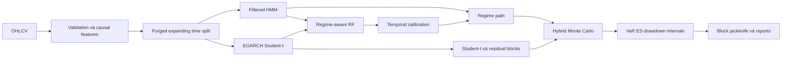

# VN-Index Regime-Aware Random Forest và Hybrid Monte Carlo

Tác giả: **Nguyễn Hoài Nam**

Pipeline nghiên cứu tái lập để dự báo riêng lợi suất, mức điểm, trạng thái Bull/Sideway/Bear/Stress và phân phối rủi ro VN-Index. Kiến trúc chính kết hợp Filtered HMM, EGARCH Student-t, soft-gated Random Forest, regime-conditioned block bootstrap, hybrid Monte Carlo và block jackknife.

> Đây là nghiên cứu định lượng, không phải khuyến nghị đầu tư.

## Dữ liệu

Tệp `data/raw/VNINDEX_Daily.csv` có 6,306 phiên từ 2000-07-28 đến 2026-07-13. CSV nguồn có dấu phẩy hàng nghìn không được quote; parser phục hồi OHLCV và xác minh High/Low. Pipeline không nội suy close qua ngày thiếu.

## Kiến trúc



Với horizon `h`, `R(t,h)=log(P(t+h)/P(t))` và `P_hat(t+h)=P(t) exp(R_hat(t,h))`. HMM chỉ xuất `P(S_t|F_t)` bằng forward recursion; không dùng smoothed posterior. Split purge bằng `target_end_date_h < boundary` và embargo bằng horizon lớn nhất.

## Cài đặt và chạy

```bash
conda env create -f environment.yml
conda activate vnindex-model
python -m pip install -e .
pytest -q
python -m vnindex_model.cli run-all --config configs/quick.yaml
```

Các lệnh độc lập: `validate-data`, `train`, `backtest`, `forecast`, `report`, `run-all`. Makefile cung cấp `make install`, `make test`, `make quick`, `make full`, `make forecast`, `make report`.

## Kết quả test ngoài mẫu

| horizon | model | rmse_return | directional_accuracy |
| --- | --- | --- | --- |
| 1 | random_walk_drift | 0.0122777086974705 | 0.5512073272273106 |
| 5 | random_walk_drift | 0.0282305866688544 | 0.5747702589807853 |
| 10 | random_walk_drift | 0.0399382005832367 | 0.5620805369127517 |
| 20 | random_walk_drift | 0.0573303654593323 | 0.5939086294416244 |
| 40 | random_walk_drift | 0.0817270993382497 | 0.6024096385542169 |
| 60 | random_walk_drift | 0.098359190891612 | 0.6252189141856392 |


Đây là point metrics; kết quả trạng thái, calibration, interval và tail risk nằm trong `reports/tables/`. Mô hình có RMSE tốt nhất không tự động có recall Bear/Stress hoặc VaR coverage tốt nhất. Kết luận superiority chỉ được chấp nhận khi DM/HAC và block-bootstrap CI hỗ trợ; xem báo cáo để biết kết luận của run này.

Ở h=20, mô hình chính có RMSE **0.067470**, Bear/Stress recall **0.00%/0.00%**, trong khi **random_walk_drift** có RMSE **0.057330**. Interval 95% chỉ cover **86.29%**. Do đó run này **không đủ bằng chứng để kết luận mô hình chính tốt hơn baseline** và tail calibration chưa đạt nominal.

## Forecast 20 phiên mới nhất

- Origin: 2026-07-13; close cuối: 1800.54.
- Terminal mean/median: 1792.85 / 1792.80.
- Xác suất tăng/giảm: 45.49% / 54.51%.
- VaR 95% và ES 95%: -7.07% / -8.91%.
- P(maximum drawdown vượt 5%): 26.07%.
- Estimated trading dates dùng ngày làm việc gần đúng, chưa loại ngày nghỉ HOSE.


## Cấu trúc và tái lập

- `src/vnindex_model/`: module dữ liệu, target, split, HMM, EGARCH, RF, calibration, simulation, bootstrap, jackknife, baseline, evaluation và reporting.
- `configs/`: quick/default/full với seed, paths và compute budget rõ ràng.
- `artifacts/`: model, metadata, latest forecast và NPZ samples.
- `reports/`: CSV/Markdown, 36 hình và hai báo cáo tiếng Việt.
- `tests/`: leakage, parser, split, filtered probability, simulation, metric và smoke tests.

Để cập nhật, thay file trong `data/raw/` bằng OHLCV mới, cập nhật `project.data_path` nếu tên đổi và chạy lại `run-all`. Mọi số liệu trong README này được ghi lại từ pipeline; không chỉnh tay sau run.

## Hạn chế

Structural break, sparse Stress class, calibration drift, proxy lịch ngày làm việc, sai số HMM/EGARCH và giả định residual lịch sử còn đại diện đều có thể làm forecast lệch. Monte Carlo paths là các kịch bản có điều kiện; median path không phải quỹ đạo chắc chắn. Không có kết quả nào ở đây bảo đảm hiệu quả giao dịch.
