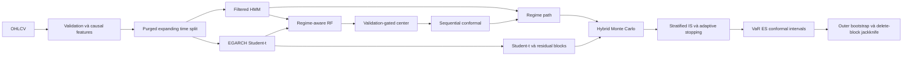

# VN-Index Regime-Aware Random Forest và Hybrid Monte Carlo

Tác giả: **Nguyễn Hoài Nam**

Pipeline nghiên cứu tái lập để dự báo lợi suất, mức điểm, trạng thái Bull/Sideway/Bear/Stress và phân phối rủi ro VN-Index. Kiến trúc giữ Filtered HMM, EGARCH Student-t và regime-aware Random Forest, đồng thời thêm validation-gated distribution center, sequential conformal, stratified/importance sampling, adaptive Monte Carlo, outer stationary bootstrap và delete-block jackknife.

> Đây là nghiên cứu định lượng, không phải khuyến nghị đầu tư.

## Dữ liệu

Tệp `data/raw/VNINDEX_Daily.csv` có 6,306 phiên từ 2000-07-28 đến 2026-07-13. CSV nguồn có dấu phẩy hàng nghìn không được quote; parser phục hồi OHLCV và xác minh High/Low. Pipeline không nội suy close qua ngày thiếu.

## Kiến trúc



Với horizon `h`, `R(t,h)=log(P(t+h)/P(t))` và `P_hat(t+h)=P(t) exp(R_hat(t,h))`. HMM chỉ xuất `P(S_t|F_t)` bằng forward recursion; không dùng smoothed posterior. Split purge bằng `target_end_date_h < boundary` và embargo bằng horizon lớn nhất.

## Cài đặt và chạy

```bash
conda env create -f environment.yml
conda activate vnindex-model
python -m pip install -e .
pytest -q
python -m vnindex_model.cli run-all --config configs/quick.yaml
```

Các lệnh độc lập: `validate-data`, `train`, `backtest`, `forecast`, `report`, `run-all`. Makefile cung cấp `make install`, `make test`, `make quick`, `make full`, `make forecast`, `make report`.

## Kết quả test ngoài mẫu

| horizon | model | rmse_return | directional_accuracy |
| --- | --- | --- | --- |
| 1 | random_walk_drift | 0.012277708697470534 | 0.5512073272273106 |
| 5 | random_walk_drift | 0.02823058666885448 | 0.5747702589807853 |
| 10 | random_walk_drift | 0.03993820058323676 | 0.5620805369127517 |
| 20 | random_walk_drift | 0.05733036545933233 | 0.5939086294416244 |
| 40 | random_walk_drift | 0.08172709933824973 | 0.6024096385542169 |
| 60 | random_walk_drift | 0.09835919089161207 | 0.6252189141856392 |


Đây là point metrics; kết quả trạng thái, calibration, interval và tail risk nằm trong `reports/tables/`. Mô hình có RMSE tốt nhất không tự động có recall Bear/Stress hoặc VaR coverage tốt nhất. Kết luận superiority chỉ được chấp nhận khi DM/HAC và block-bootstrap CI hỗ trợ; xem báo cáo để biết kết luận của run này.

Ở h=20, A0 RF có RMSE **0.067470**; gated distribution center khóa alpha ML **0.00** trên validation và đạt RMSE test **0.057330**. Đây là fallback bảo vệ, không phải bằng chứng ML vượt baseline. Sequential conformal chọn **regime_stratified**: coverage 95% đổi từ **86.29%** lên **95.26%**, width từ **0.2088** lên **0.2944**, VaR exceedance từ **13.45%** xuống **4.74%**. Run đạt **7/9** acceptance checks; nếu chưa đạt toàn bộ guardrail thiết yếu thì pipeline mới vẫn là experimental.

## Trạng thái promotion

Các artifacts và báo cáo hiện tại được sinh từ `configs/experimental.yaml`. Vì chỉ đạt 7/9 acceptance checks, `configs/default.yaml` tiếp tục giữ A0 làm baseline production; không có auto-promotion. `configs/full.yaml` chưa được chạy trong lần nghiệm thu này.

## Forecast 20 phiên mới nhất

- Origin: 2026-07-13; close cuối: 1800.54.
- Terminal mean/median: 1828.11 / 1826.41.
- Xác suất tăng/giảm: 60.34% / 39.66%.
- VaR 95% và ES 95%: -7.59% / -9.97%.
- P(maximum drawdown vượt 5%): 35.03%.
- Estimated trading dates dùng ngày làm việc gần đúng, chưa loại ngày nghỉ HOSE.


Biểu đồ tóm tắt đặt dự báo trung vị cuối horizon **1826.41** bên cạnh xác suất tăng **60.34%**. Đây là phân phối có điều kiện từ thông tin tại origin, không phải target giá đơn điểm.


Fan chart cho thấy khoảng bất định mở rộng theo horizon; độ rộng interval 95% tại terminal là **389.23 điểm**. Dải rộng phản ánh cả process noise, regime/volatility và model uncertainty, nên không nên chỉ đọc đường median.


Hình chỉ hiển thị một mẫu nhỏ trong **40,000** paths để tránh rối hình. Mỗi path là một kịch bản tương thích với giả định mô hình; không path nào là quỹ đạo “được chọn”.


Regime probability là filtered `P(S_t|F_t)` nên chỉ dùng dữ liệu sẵn có tại thời điểm t; không dùng smoothed state nhìn về tương lai. State là trạng thái thống kê ẩn, không phải nhãn thị trường chắc chắn.


Reliability diagram so xác suất dự báo với tỷ lệ quan sát trong từng bin; khoảng cách với đường chéo là calibration gap. Biểu đồ này không thay thế backtest coverage của return interval hay direct drawdown conformal.


Maximum drawdown trong 20 phiên có median **3.98%**, mean **4.52%** và phía xấu 95% ở **9.43%**. Đây là tổn thất peak-to-trough trong đường đi, vì vậy có thể lớn ngay cả khi terminal return dương.

## Cấu trúc và tái lập

- `src/vnindex_model/`: thêm `point_forecast.py`, `conformal.py`, `importance_sampling.py`, `tail_head.py`; simulation/bootstrap/jackknife được mở rộng.
- `configs/`: `default.yaml` khóa A0; `quick.yaml`, `experimental.yaml`, `full.yaml` là các mức compute cho pipeline A1-A9.
- `artifacts/`: model, metadata, latest forecast và NPZ samples.
- `reports/`: bảng CSV/Markdown, 70 hình và hai báo cáo tiếng Việt; baseline cũ nằm trong `reports/archive/`.
- `tests/`: leakage, parser, split, filtered probability, simulation, metric và smoke tests.

Để cập nhật, thay file trong `data/raw/` bằng OHLCV mới, cập nhật `project.data_path` nếu tên đổi và chạy lại `run-all`. Mọi số liệu trong README này được ghi lại từ pipeline; không chỉnh tay sau run.

## Hạn chế

Structural break, sparse Stress class, calibration drift, proxy lịch ngày làm việc, sai số HMM/EGARCH và giả định residual lịch sử còn đại diện đều có thể làm forecast lệch. Monte Carlo paths là các kịch bản có điều kiện; median path không phải quỹ đạo chắc chắn. Không có kết quả nào ở đây bảo đảm hiệu quả giao dịch.


## Calibrated drawdown forecast

Hai anchor `origin_peak` và `historical_peak`, MDaR/CED, first passage, recovery censoring, probability CI và direct drawdown conformal được sinh từ pipeline. Các biểu đồ dùng `drawdown_severity=-drawdown_return>=0` để mức lỗ được đọc bằng số dương. Module đạt **8/9** acceptance checks và vẫn ở trạng thái experimental.

### Fan chart theo hai drawdown anchor


Origin-peak reset đỉnh tại forecast origin. Median severity cuối horizon là **2.07%**, trong khi expected maximum severity trong đường đi là **4.52%**. Chênh lệch này cho thấy terminal return dương vẫn có thể đi qua một nhịp giảm đáng kể trước khi hồi phục.


Historical-peak không reset drawdown. VN-Index đang thấp hơn historical peak khoảng **6.61%**, nên median ending severity là **5.33%** và historical-anchor MDaR95 lên **14.52%**. Hai fan chart trả lời hai câu hỏi khác nhau: rủi ro mới từ hôm nay và tổng thiệt hại so với đỉnh lịch sử.

### First passage và MDaR/CED


Xác suất tích lũy breach 3/5/7/10% đến phiên 20 lần lượt là **67.81%/35.03%/15.87%/3.78%**. Các đường không giảm vì một path đã chạm ngưỡng vẫn được tính là đã breach ở mọi bước sau; đây không phải xác suất drawdown tức thời tại từng phiên.


Origin-peak MDaR90/95/99 là **8.04%/9.43%/12.36%**; CED90/95/99 là **9.95%/11.23%/13.93%**. MDaR là quantile của maximum drawdown severity; CED là trung bình phía xấu hơn quantile đó, không phải VaR/ES của terminal return.

### Recovery và direct drawdown calibration


Xác suất quay lại historical peak trong 20 phiên là **22.00%**. Các path chưa hồi phục được giữ right-censored; median recovery time không được tính bằng cách ép chúng về ngày 20.


Ở h=20, direct conformal đạt coverage MDaR95 **94.67%** và MDaR99 **99.24%**. Phương pháp được khóa trên validation; test chỉ đánh giá. Exceedance vẫn phụ thuộc mạnh do các horizon chồng lấn, vì vậy aggregate coverage tốt không đồng nghĩa các lỗi độc lập theo thời gian.


Conditional coverage 95% theo filtered regime là state 0: **96.00% (n=100)**, state 3: **94.29% (n=1,033)** và state 4: **100.00% (n=49)**. Nhóm nhỏ có coverage 100% không nên được xem là calibration hoàn hảo; sample size thấp làm ước lượng kém ổn định và pipeline fallback về global khi validation stratum không đủ mẫu.

### Rare-event efficiency và stress scenarios


Các proposal đạt gate ở MDD 7/10/15% với variance-reduction ratio từ **1.38x** đến **5.13x** và ESS/N **80.24%**. Proposal MDD 5% chỉ đạt **1.04x**, dưới gate 1.30x, nên bị từ chối. Importance sampling giảm numerical variance; nó không làm drawdown dễ dự báo hơn.


Baseline MDaR95/CED95 là **9.43%/11.23%**. Bear-conditioned tăng lên **9.82%/11.82%**; volatility +2σ tăng mạnh tới **18.49%/21.71%**. Historical-crisis blocks cho MDaR95 **9.79%** và recovery **12.92%**. Stress-conditioned hiện trùng baseline vì không đủ path khởi đầu Stress và engine fallback; đây là giới hạn mẫu, không phải bằng chứng Stress vô hại. Scenario là conditional what-if, không phải xác suất dự báo.

Các bảng chi tiết nằm trong `reports/tables/drawdown_*.csv`; artifacts mới nhất nằm trong `artifacts/forecasts/latest_drawdown_*`.
