# Báo cáo mô hình VN-Index Filtered HMM – EGARCH – Regime-Aware Random Forest

## 1. Tóm tắt

Pipeline dự báo riêng lợi suất, mức điểm, trạng thái và phân phối rủi ro ở các horizon [1, 5, 10, 20, 40, 60]. Dữ liệu thật kết thúc ngày 2026-07-13. Kết luận so sánh: **chưa có đủ bằng chứng để kết luận mô hình chính tốt hơn baseline mạnh nhất; ở h=20, random_walk_drift có rmse 0.057330**.

## 2. Mục tiêu và phạm vi

Mục tiêu vận hành là 20 phiên. Dự báo điểm, phân loại trạng thái và mô phỏng tail risk là ba nhiệm vụ khác nhau; metric của chúng không được thay thế cho nhau.

## 3. Dữ liệu và chất lượng

- Nguồn: `data/raw/VNINDEX_Daily.csv`; hash `b9223de5500676ccd64fdb29edc27bf2c28bc04f424397dd3058e674737ea379`.
- 6,306 phiên từ 2000-07-28 đến 2026-07-13.
- Xóa 1 bản ghi trùng chính xác; vi phạm OHLC: 42.
- Không nội suy close qua phiên thiếu. Estimated trading dates tương lai chỉ dùng ngày làm việc gần đúng, chưa loại ngày nghỉ HOSE.

## 4. Cơ sở lý thuyết và kiến trúc

Return horizon: `R(t,h)=log(P(t+h)/P(t))`; giá suy ra `P_hat=P(t) exp(R_hat)`. Target regime dùng ngưỡng biến động quá khứ và Stress override theo forward maximum drawdown. Lambda được chọn theo class sufficiency và độ ổn định phân phối giữa train/validation; test không tham gia.

Filtered HMM được fit trên train và tính đúng `P(S_t | F_t)` bằng forward recursion; không gọi posterior smoothed trên toàn chuỗi. EGARCH(1,1) Student-t dùng shock đã chuẩn hóa phương sai. RF gồm global, HMM-feature, HMM+EGARCH và soft-gated experts. Calibration sigmoid/isotonic/none được chọn trên validation theo thời gian.

Hybrid simulation lấy shock từ hỗn hợp empirical regime-conditioned và standardized Student-t. Regime transition ở bước j là `q_ik ∝ P_ik^(1-eta_j) p_RF,k^eta_j`, sau đó chuẩn hóa.

## 5. Feature engineering và target

Feature gồm return/momentum, SMA/EMA/MACD, volatility/tail, drawdown, OHLC range, volume và lịch. Rolling feature chỉ nhìn hiện tại/quá khứ, không backfill. Feature variance/correlation được kiểm soát chỉ trên train. Mỗi horizon lưu `target_end_date_h` để purge đúng.

## 6. Validation methodology

Train 60%, validation 20%, untouched test cuối 20%; purge theo ngày kết thúc nhãn và embargo 60 phiên. Test không dùng để chọn K, RF, calibration hay threshold. Block bootstrap và HAC/DM đo bất định so sánh. Jackknife run này ở chế độ `quick` trên OOS records, không phải bộ sinh path.

## 7. Kết quả dự báo điểm

| horizon | model | rmse_return |
| --- | --- | --- |
| 1 | random_walk_drift | 0.012277708697470534 |
| 5 | random_walk_drift | 0.02823058666885448 |
| 10 | random_walk_drift | 0.03993820058323676 |
| 20 | random_walk_drift | 0.05733036545933233 |
| 40 | random_walk_drift | 0.08172709933824973 |
| 60 | random_walk_drift | 0.09835919089161207 |

R² được báo cáo nhưng không được diễn giải như hiệu quả giao dịch. Bảng đầy đủ nằm ở `tables/model_comparison.csv` và `tables/per_horizon_metrics.csv`.

## 8. Phân loại, calibration và tail risk

Confusion matrix, per-class recall, Brier, log loss và ECE được báo cáo riêng. Khả năng dự báo điểm tốt không bảo đảm recall Bear/Stress tốt. VaR/ES là thống kê có điều kiện theo mô hình, không phải mức lỗ tối đa.

## 9. Kiểm định thống kê và ablation

Chưa có đủ bằng chứng để kết luận mô hình chính tốt hơn baseline mạnh nhất; ở h=20, random_walk_drift có RMSE 0.057330. DM dùng HAC theo horizon; block bootstrap CI dùng các block liên tiếp. Nhiều phép so sánh làm tăng false discovery nên p-value cần được đọc thận trọng. Ablation tách HMM, EGARCH, soft gate, calibration và các simulation method; jackknife chỉ bổ sung đo ổn định, không cải thiện point forecast theo cơ chế.

## 10. Forecast mới nhất

- Origin: 2026-07-13; close cuối: 1800.54.
- Terminal mean/median: 1792.85 / 1792.80.
- Xác suất tăng/giảm: 45.49% / 54.51%.
- VaR 95%/99%: -7.07% / -10.16%.
- ES 95%/99%: -8.91% / -11.60%.
- Expected maximum drawdown: -3.87%; P(MDD ≤ -5%): 26.07%.

## 11. Phân tích 36 biểu đồ

### Hình 1: 01_data_splits

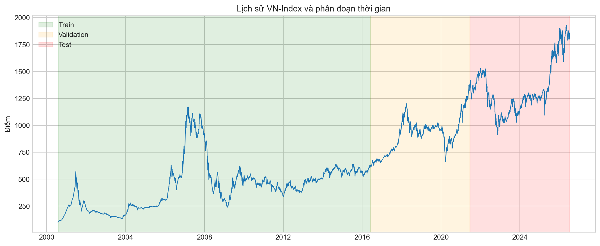

Train kết thúc 2016-06-07, test bắt đầu sau boundary 2021-06-22; test là đoạn cuối và không tham gia tuning.

### Hình 2: 02_log_returns

Log-return trung bình 0.0458%/phiên, độ lệch chuẩn 1.4384%; cực trị quan sát [-7.66%, 6.67%].

### Hình 3: 03_return_distribution

Return có skewness -0.421 và excess kurtosis 3.59; EGARCH ước lượng ν=11.04, nên Student-t phản ánh tail dày hơn Gaussian.

### Hình 4: 04_rolling_volatility

Rolling volatility 20 phiên hiện tại là 0.809%, so với median lịch sử 1.015%.

### Hình 5: 05_historical_drawdown

Drawdown sâu nhất trong mẫu là -79.88%; drawdown tại ngày cuối là -6.61%.

### Hình 6: 06_hmm_regimes

Filtered HMM chọn 5 state, seed 55; nhãn kinh tế được xếp từ return, volatility và drawdown train, không theo số state.

### Hình 7: 07_filtered_probabilities

Entropy regime ngày cuối là 0.253; xác suất được forward-filter, không smoothed.

### Hình 8: 08_transition_matrix

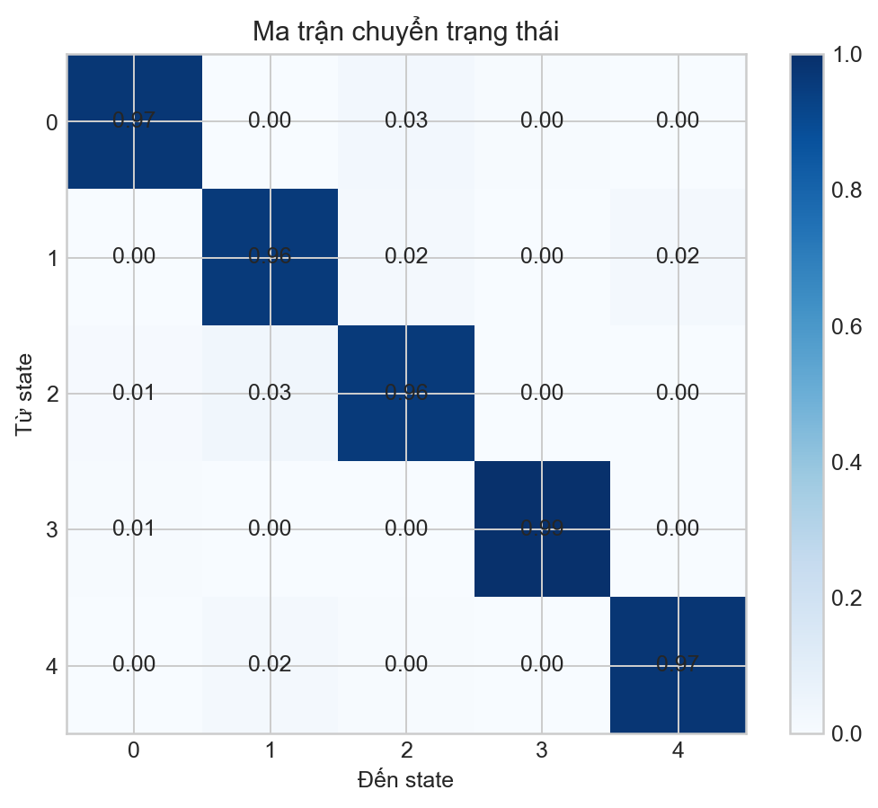

Xác suất tự chuyển lớn nhất là 99.30%, tương ứng expected duration xấp xỉ 142.7 phiên.

### Hình 9: 09_egarch_volatility

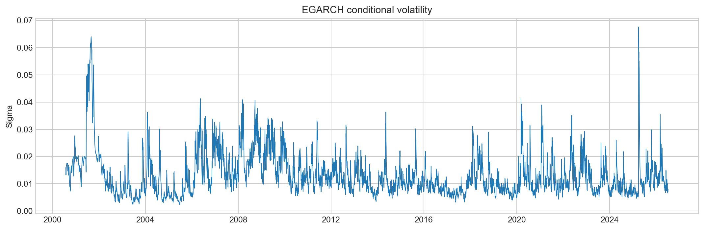

EGARCH Student-t hội tụ=True; ν=11.04. Validation QLIKE chọn historical_volatility (-8.4616).

### Hình 10: 10_residual_diagnostics

Residual diagnostic cho Ljung–Box p=4.6e-84; squared-residual p=0.0768.

### Hình 11: 11_residual_acf

Squared-residual Ljung–Box p=0.0768; giá trị thấp sẽ là bằng chứng volatility dynamics còn sót lại.

### Hình 12: 12_feature_importance

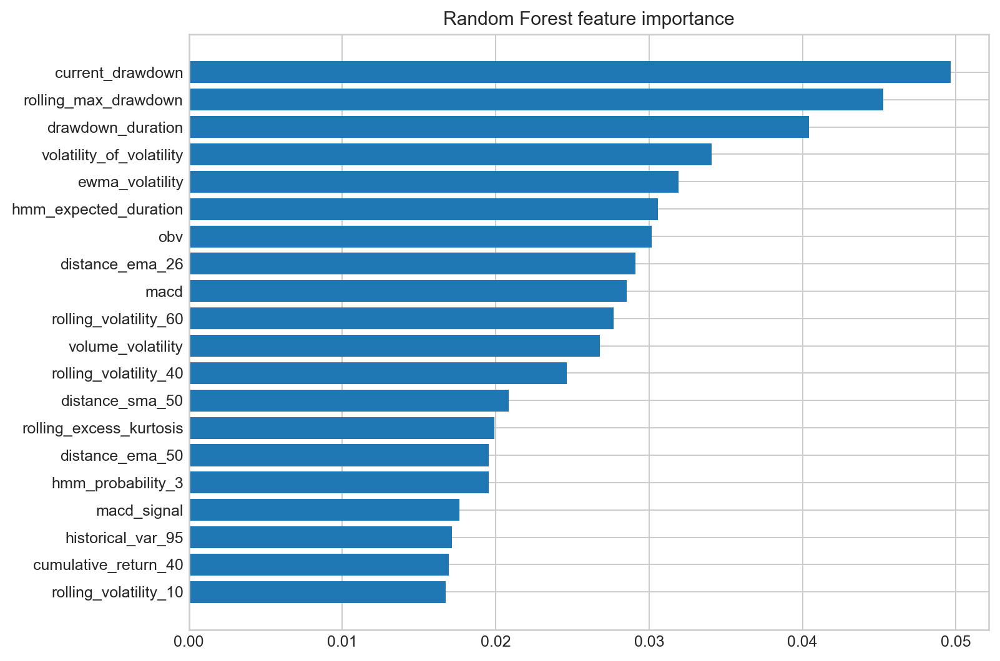

Ba feature impurity-importance cao nhất của return forest h=20 là current_drawdown, rolling_max_drawdown, drawdown_duration; importance không đồng nghĩa quan hệ nhân quả.

### Hình 13: 13_grouped_permutation_importance

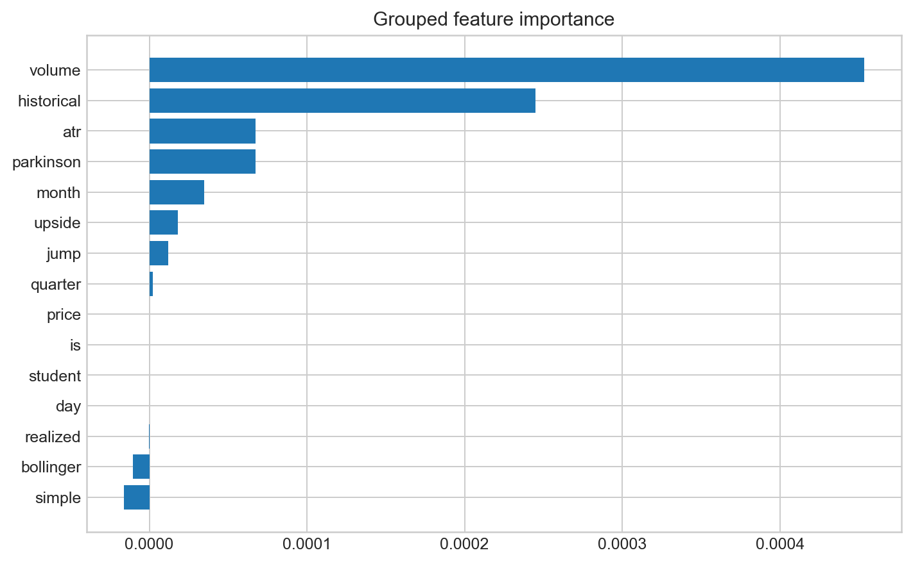

Grouped permutation được tính trên test với 3 lần lặp; top feature riêng lẻ có permutation delta -0.001706 theo negative MAE.

### Hình 14: 14_partial_dependence

Đường binned effect dùng feature current_drawdown; đây là quan hệ dự báo có điều kiện, không phải tác động nhân quả.

### Hình 15: 15_confusion_matrix

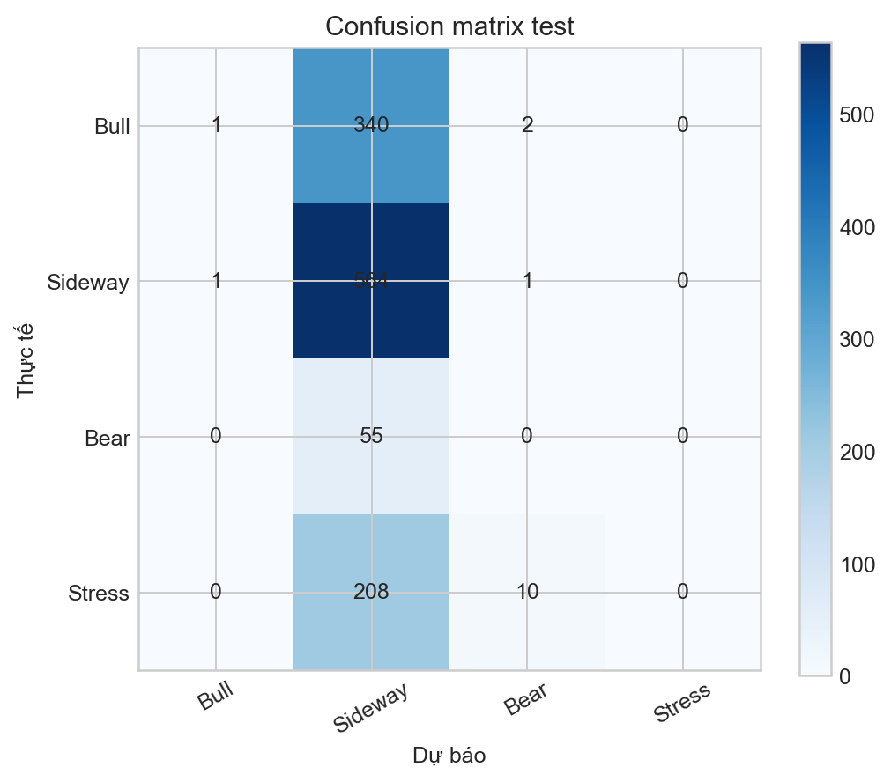

H=20 chọn λ hướng=0.75, λ stress=1.60; test có 55 Bear và 218 Stress, recall=0.00%/0.00%.

### Hình 16: 16_reliability_diagram

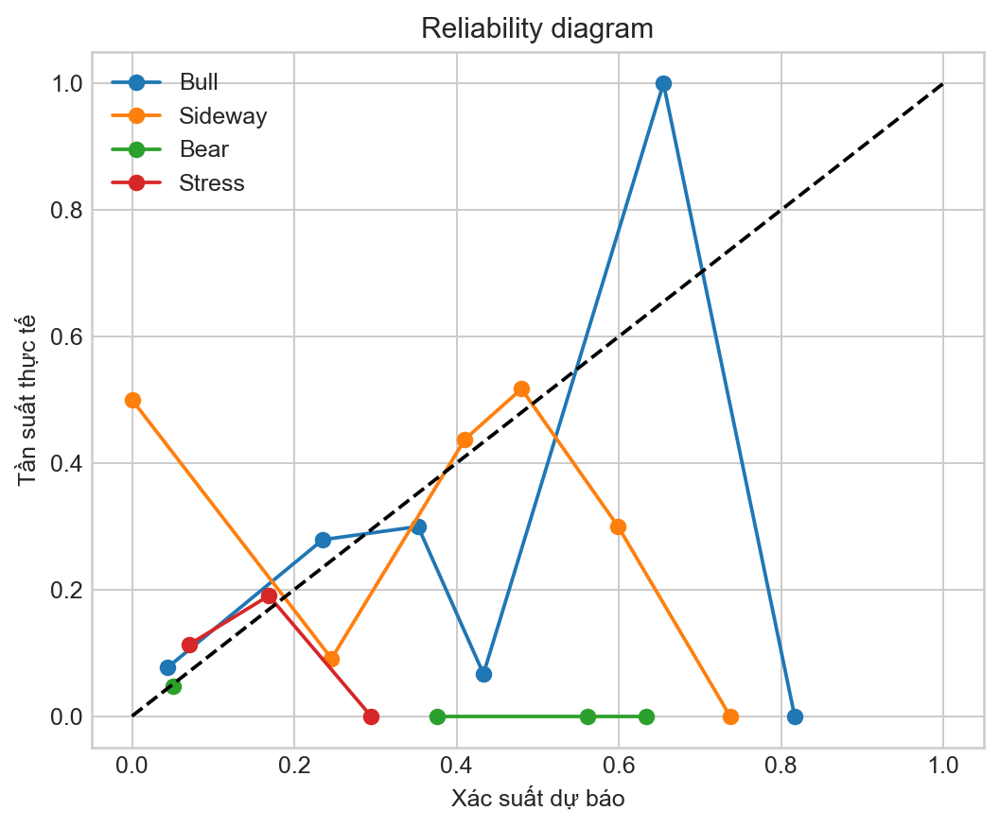

Calibration h=20 chọn isotonic; test ECE=0.0336, slope=0.130, intercept=-0.068.

### Hình 17: 17_actual_predicted_return

H=20 RMSE return=0.067470, correlation=-0.100, directional accuracy=47.80%.

### Hình 18: 18_actual_predicted_price

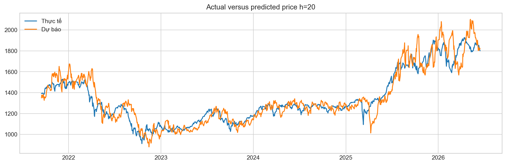

H=20 MAE price=70.15, RMSE price=95.71, sMAPE=5.13%.

### Hình 19: 19_rolling_error

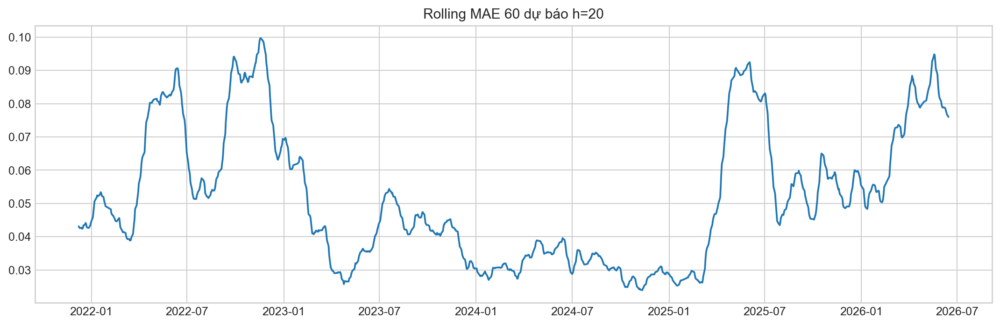

Mean signed error h=20=0.4391%; rolling MAE cho thấy sai số tập trung theo giai đoạn thay vì ổn định hoàn toàn.

### Hình 20: 20_model_comparison

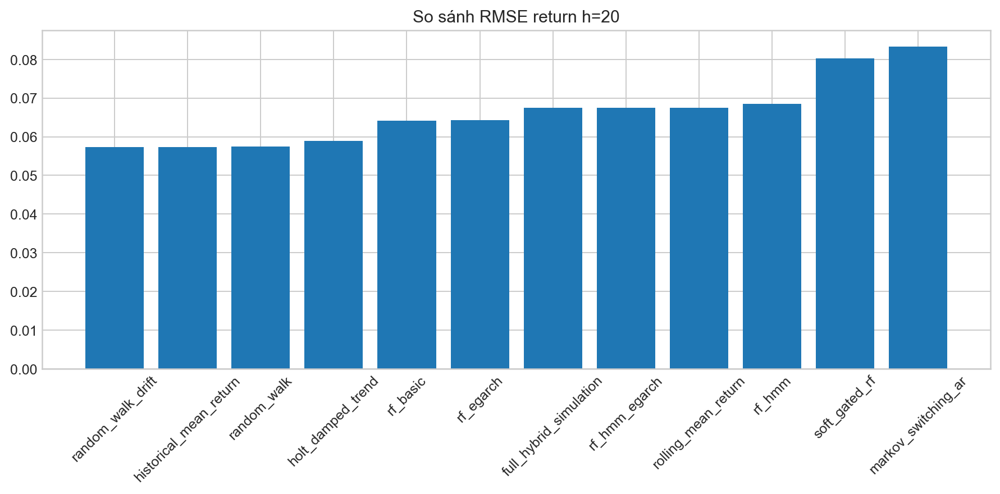

Ở h=20, RMSE thấp nhất thuộc random_walk_drift (0.057330). Chưa có đủ bằng chứng để kết luận mô hình chính tốt hơn baseline mạnh nhất; ở h=20, random_walk_drift có RMSE 0.057330.

### Hình 21: 21_interval_coverage_width

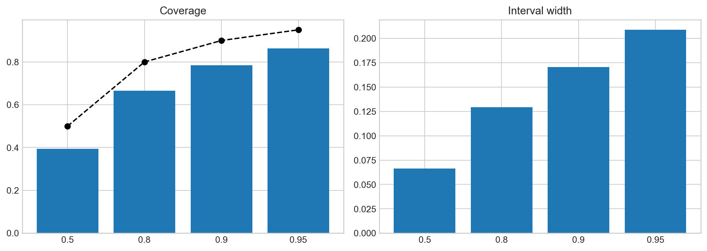

Mức 95% gần nominal nhất nhưng coverage=86.29%, error=-8.71%, width=0.2088.

### Hình 22: 22_diebold_mariano

Có 10/48 phép DM thuận lợi và p<5% trước hiệu chỉnh multiple comparisons; điều này không đủ để thắng baseline mạnh nhất.

### Hình 23: 23_ablation_study

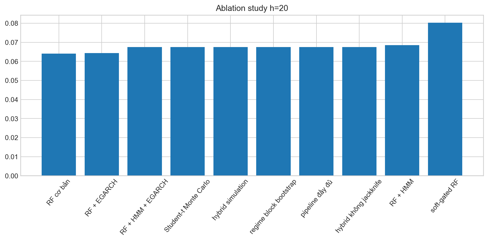

Ablation h=20 có Brier thấp nhất ở RF + HMM + EGARCH (0.6573); jackknife chỉ đo ổn định, không đổi point forecast.

### Hình 24: 24_monte_carlo_paths

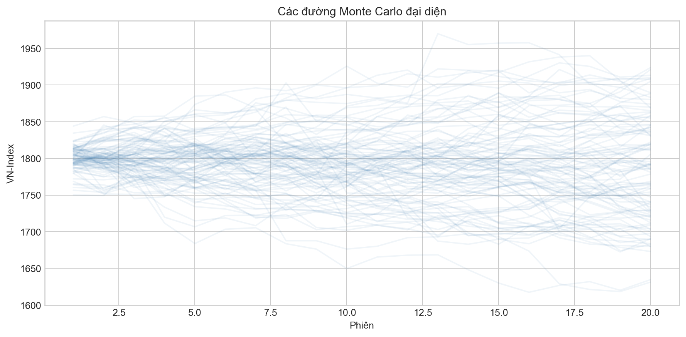

Hình chỉ vẽ tối đa 100 path trong 10,000 path; mỗi path là kịch bản có điều kiện, không phải dự báo chắc chắn độc lập.

### Hình 25: 25_fan_chart

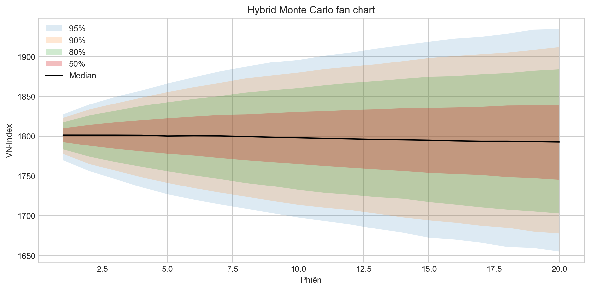

Median terminal 1792.80; interval 95% [1655.01, 1934.49], P(return âm)=54.51%.

### Hình 26: 26_forecast_quantiles

Terminal mean 1792.85 và median 1792.80; chênh 0.05 điểm phản ánh bất đối xứng nhỏ.

### Hình 27: 27_terminal_price_distribution

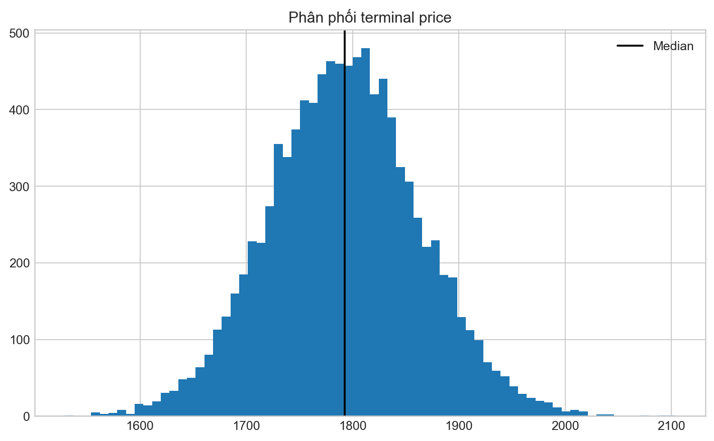

Terminal mean/median là 1792.85/1792.80; độ rộng interval 95% là 279.49 điểm.

### Hình 28: 28_terminal_return_distribution

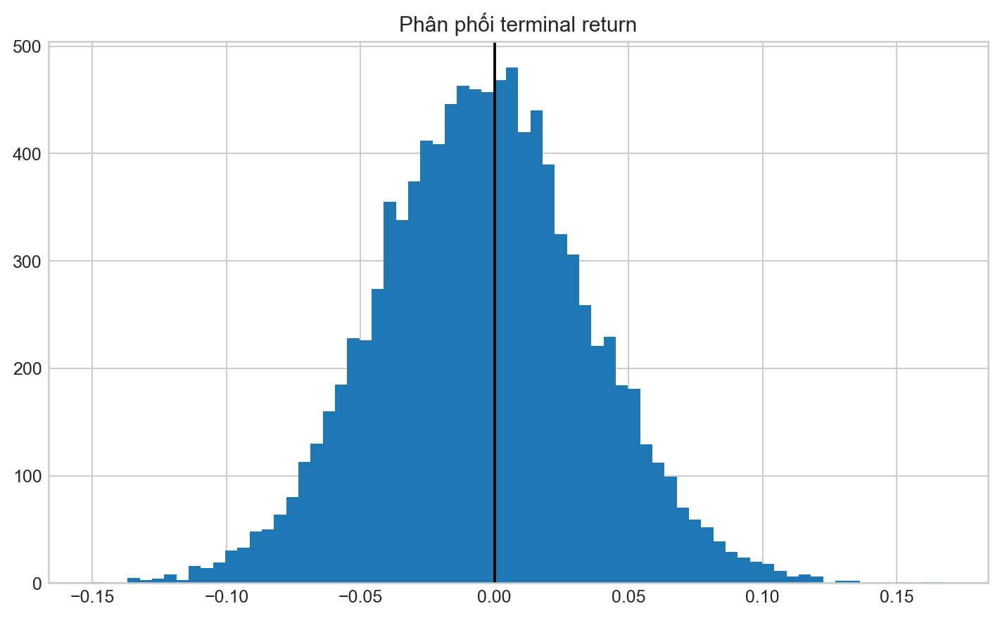

Expected/median terminal return là -0.43%/-0.43%; P(tăng)=45.49%.

### Hình 29: 29_maximum_drawdown_distribution

Expected/median MDD là -3.87%/-3.45%; quantile xấu 5%=-7.96%.

### Hình 30: 30_var_expected_shortfall

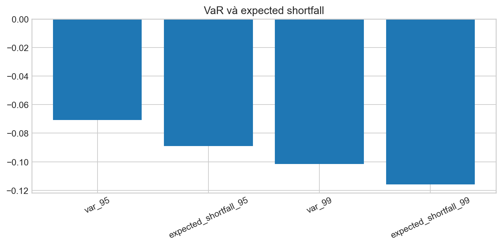

VaR 95%=-7.07%, ES 95%=-8.91%; backtest h=20 có exceedance 95%=13.45% (Kupiec p=0).

### Hình 31: 31_drawdown_probabilities

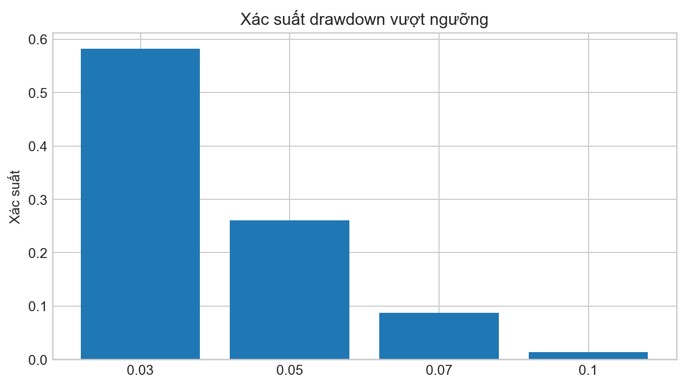

P(MDD vượt 3/5/7/10%) lần lượt 58.26%, 26.07%, 8.69%, 1.39%.

### Hình 32: 32_forecast_regime_probabilities

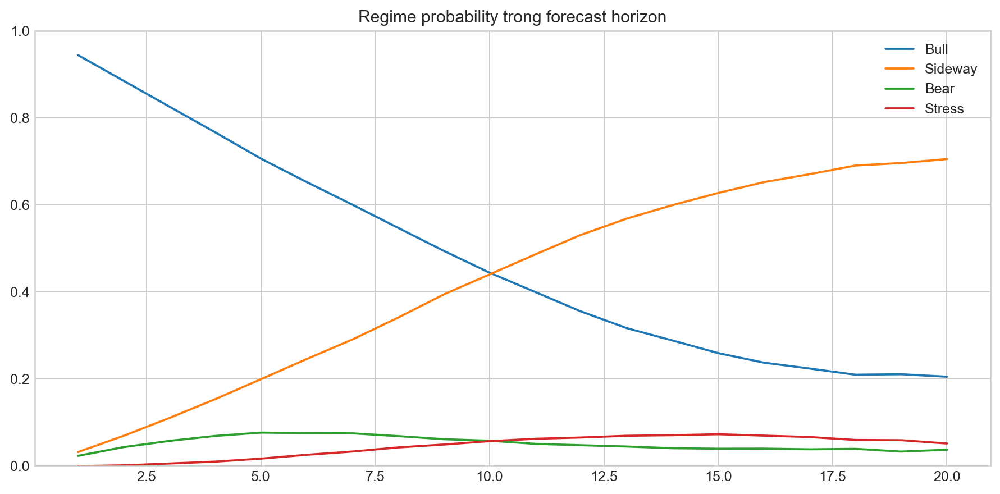

Ở bước 20, Bull/Sideway/Bear/Stress lần lượt 20.53%/70.53%/3.75%/5.19%.

### Hình 33: 33_simulation_comparison

ES95 giữa Student-t/bootstrap/hybrid dao động từ -8.91% đến -8.30%; hybrid dùng student weight 0.35.

### Hình 34: 34_jackknife_sensitivity

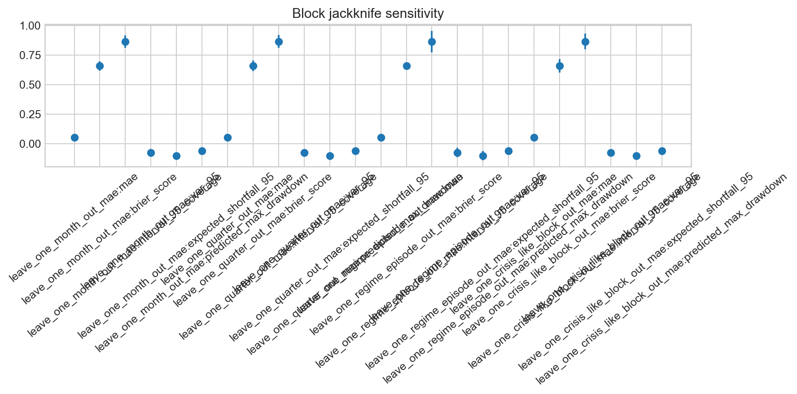

Block nhạy nhất là leave_one_regime_episode_out_mae:interval_95_coverage với CI [0.7716, 0.9543]; run dùng record-level quick jackknife.

### Hình 35: 35_seed_stability

RMSE h=20 qua 5 seed nằm trong [0.067470, 0.069454], std=0.000879.

### Hình 36: 36_latest_forecast

Origin 2026-07-13; median return -0.43%, P(tăng/giảm)=45.49%/54.51%, P(MDD>5%)=26.07%.

## 12. Khả năng ứng dụng và hạn chế

Kết quả phù hợp cho stress testing và tham khảo phân phối có điều kiện, không phải khuyến nghị đầu tư. Giới hạn gồm structural break, proxy lịch giao dịch, sai số ước lượng HMM/EGARCH, sparse Stress class, calibration drift và giả định shock lịch sử còn đại diện. Không đánh đồng accuracy trạng thái với lợi nhuận chiến lược.

## 13. Hướng phát triển

Mở rộng nested model-refit bootstrap, calendar HOSE chính thức, covariate vĩ mô có timestamp kiểm chứng, conformal intervals theo regime và đánh giá live forward không tái sử dụng test.
