# Báo cáo mô hình VN-Index Filtered HMM – EGARCH – Regime-Aware Random Forest

## 1. Tóm tắt

Pipeline dự báo riêng lợi suất, mức điểm, trạng thái và phân phối rủi ro ở các horizon [1, 5, 10, 20, 40, 60]. Dữ liệu thật kết thúc ngày 2026-07-13. Kết luận so sánh: **chưa có đủ bằng chứng để kết luận mô hình chính tốt hơn baseline mạnh nhất; ở h=20, random_walk_drift có rmse 0.057330**.

Run hiện tại dùng `configs/experimental.yaml` với mode `experimental`. Do acceptance chỉ đạt 7/9, cấu hình production mặc định không được thay thế.

## 2. Mục tiêu và phạm vi

Mục tiêu vận hành là 20 phiên. Dự báo điểm, phân loại trạng thái và mô phỏng tail risk là ba nhiệm vụ khác nhau; metric của chúng không được thay thế cho nhau.

## 3. Dữ liệu và chất lượng

- Nguồn: `data/raw/VNINDEX_Daily.csv`; hash `b9223de5500676ccd64fdb29edc27bf2c28bc04f424397dd3058e674737ea379`.
- 6,306 phiên từ 2000-07-28 đến 2026-07-13.
- Xóa 1 bản ghi trùng chính xác; vi phạm OHLC: 42.
- Không nội suy close qua phiên thiếu. Estimated trading dates tương lai chỉ dùng ngày làm việc gần đúng, chưa loại ngày nghỉ HOSE.

## 4. Cơ sở lý thuyết và kiến trúc

Return horizon: `R(t,h)=log(P(t+h)/P(t))`; giá suy ra `P_hat=P(t) exp(R_hat)`. Target regime dùng ngưỡng biến động quá khứ và Stress override theo forward maximum drawdown. Lambda được chọn theo class sufficiency và độ ổn định phân phối giữa train/validation; test không tham gia.

Filtered HMM được fit trên train và tính đúng `P(S_t | F_t)` bằng forward recursion; không gọi posterior smoothed trên toàn chuỗi. EGARCH(1,1) Student-t dùng shock đã chuẩn hóa phương sai. RF gồm global, HMM-feature, HMM+EGARCH và soft-gated experts. Calibration sigmoid/isotonic/none được chọn trên validation theo thời gian.

Hybrid simulation lấy shock từ hỗn hợp empirical regime-conditioned và standardized Student-t. Regime transition ở bước j là `q_ik ∝ P_ik^(1-eta_j) p_RF,k^eta_j`, sau đó chuẩn hóa.

## 5. Feature engineering và target

Feature gồm return/momentum, SMA/EMA/MACD, volatility/tail, drawdown, OHLC range, volume và lịch. Rolling feature chỉ nhìn hiện tại/quá khứ, không backfill. Feature variance/correlation được kiểm soát chỉ trên train. Mỗi horizon lưu `target_end_date_h` để purge đúng.

## 6. Validation methodology

Train 60%, validation 20%, untouched test cuối 20%; purge theo ngày kết thúc nhãn và embargo 60 phiên. Test không dùng để chọn K, RF, calibration hay threshold. Block bootstrap và HAC/DM đo bất định so sánh. Jackknife run này ở chế độ `quick` trên OOS records, không phải bộ sinh path.

## 7. Kết quả dự báo điểm

| horizon | model | rmse_return |
| --- | --- | --- |
| 1 | random_walk_drift | 0.012277708697470534 |
| 5 | random_walk_drift | 0.02823058666885448 |
| 10 | random_walk_drift | 0.03993820058323676 |
| 20 | random_walk_drift | 0.05733036545933233 |
| 40 | random_walk_drift | 0.08172709933824973 |
| 60 | random_walk_drift | 0.09835919089161207 |

R² được báo cáo nhưng không được diễn giải như hiệu quả giao dịch. Bảng đầy đủ nằm ở `tables/model_comparison.csv` và `tables/per_horizon_metrics.csv`.

## 8. Phân loại, calibration và tail risk

Confusion matrix, per-class recall, Brier, log loss và ECE được báo cáo riêng. Khả năng dự báo điểm tốt không bảo đảm recall Bear/Stress tốt. VaR/ES là thống kê có điều kiện theo mô hình, không phải mức lỗ tối đa.

Baseline-gated center chọn alpha h=20 là **0.00** hoàn toàn trên purged validation. Đây là cơ chế bảo vệ tâm phân phối, không phải bằng chứng ML vượt random-walk drift. Sequential conformal chọn **regime_stratified**; coverage 95% đổi từ **86.29%** lên **95.26%**, width đổi từ **0.2088** lên **0.2944**, và VaR exceedance đổi từ **13.45%** xuống **4.74%**.

Tail head chọn candidate `regime_aware_weighting` trên validation, ROC-AUC=0.512, AP=0.210, prevalence=0.222, eligible=False. Ở threshold đã khóa, test precision/recall chẩn đoán là 20.32%/70.33%. Nếu gate thất bại, multiclass head cũ tiếp tục là production.

## 9. Kiểm định thống kê và ablation

Chưa có đủ bằng chứng để kết luận mô hình chính tốt hơn baseline mạnh nhất; ở h=20, random_walk_drift có RMSE 0.057330. DM dùng HAC theo horizon; block bootstrap CI dùng các block liên tiếp. Nhiều phép so sánh làm tăng false discovery nên p-value cần được đọc thận trọng. Ablation tách HMM, EGARCH, soft gate, calibration và các simulation method; jackknife chỉ bổ sung đo ổn định, không cải thiện point forecast theo cơ chế.

Process uncertainty đến từ regime/shock paths; parameter uncertainty được outer stationary block bootstrap quick xấp xỉ; Monte Carlo numerical error được adaptive MCSE theo dõi; calibration là conformal multiplier; rare-event efficiency được đo bằng ESS và variance reduction. Importance sampling không làm tail dễ dự báo hơn. Outer bootstrap không được đánh đồng với residual bootstrap bên trong simulation.

Acceptance đạt **7/9** tiêu chí. Pipeline mới chỉ được coi là default khi toàn bộ guardrail thiết yếu đạt; nếu không, cấu hình này giữ nhãn experimental.

## 10. Forecast mới nhất

- Origin: 2026-07-13; close cuối: 1800.54.
- Terminal mean/median: 1828.11 / 1826.41.
- Xác suất tăng/giảm: 60.34% / 39.66%.
- VaR 95%/99%: -7.59% / -11.55%.
- ES 95%/99%: -9.97% / -13.54%.
- Expected maximum drawdown: -4.52%; P(MDD ≤ -5%): 35.03%.

## 11. Phân tích 53 biểu đồ

### Hình 1: 01_data_splits

Train kết thúc 2016-06-07, test bắt đầu sau boundary 2021-06-22; test là đoạn cuối và không tham gia tuning.

### Hình 2: 02_log_returns

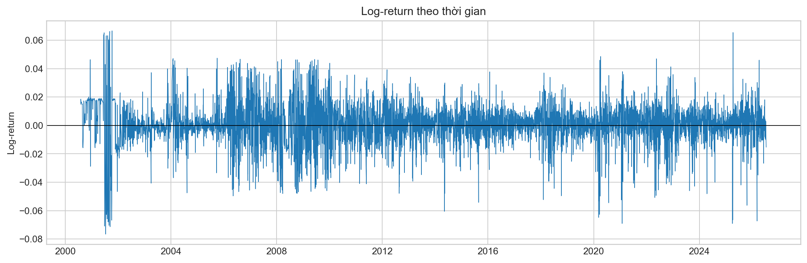

Log-return trung bình 0.0458%/phiên, độ lệch chuẩn 1.4384%; cực trị quan sát [-7.66%, 6.67%].

### Hình 3: 03_return_distribution

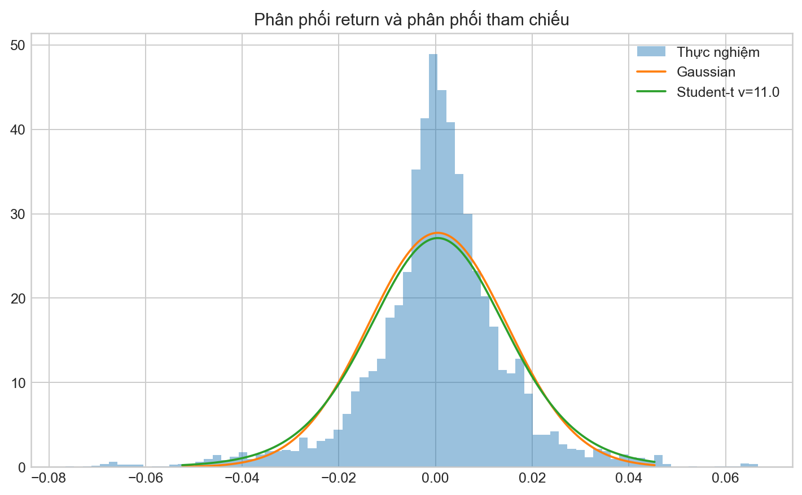

Return có skewness -0.421 và excess kurtosis 3.59; EGARCH ước lượng ν=11.04, nên Student-t phản ánh tail dày hơn Gaussian.

### Hình 4: 04_rolling_volatility

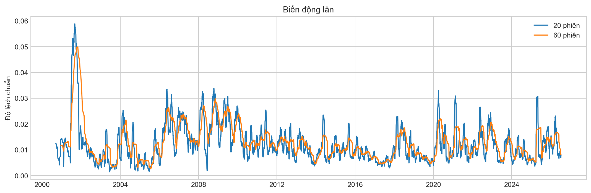

Rolling volatility 20 phiên hiện tại là 0.809%, so với median lịch sử 1.015%.

### Hình 5: 05_historical_drawdown

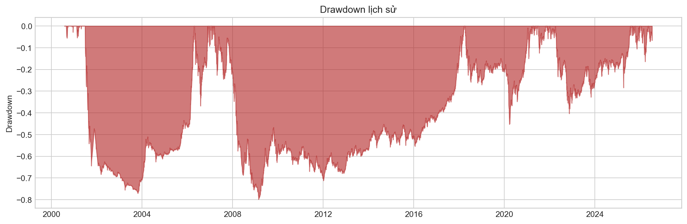

Drawdown sâu nhất trong mẫu là -79.88%; drawdown tại ngày cuối là -6.61%.

### Hình 6: 06_hmm_regimes

Filtered HMM chọn 5 state, seed 55; nhãn kinh tế được xếp từ return, volatility và drawdown train, không theo số state.

### Hình 7: 07_filtered_probabilities

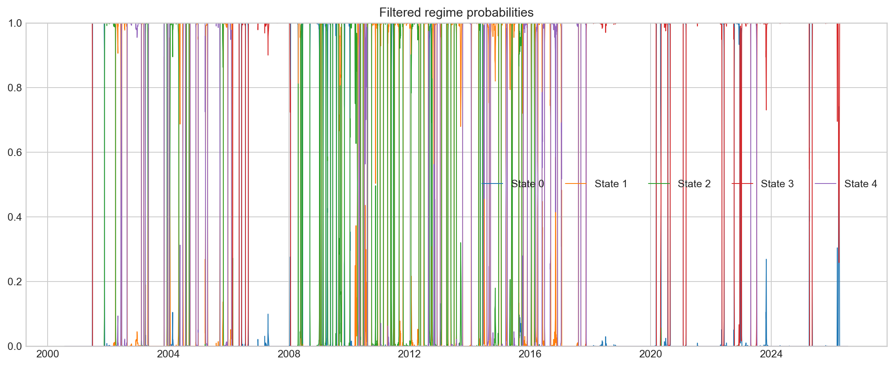

Entropy regime ngày cuối là 0.258; xác suất được forward-filter, không smoothed.

### Hình 8: 08_transition_matrix

Xác suất tự chuyển lớn nhất là 99.30%, tương ứng expected duration xấp xỉ 142.7 phiên.

### Hình 9: 09_egarch_volatility

EGARCH Student-t hội tụ=True; ν=11.04. Validation QLIKE chọn historical_volatility (-8.4616).

### Hình 10: 10_residual_diagnostics

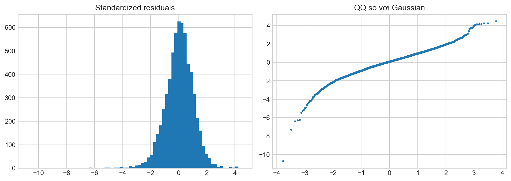

Residual diagnostic cho Ljung–Box p=4.6e-84; squared-residual p=0.0768.

### Hình 11: 11_residual_acf

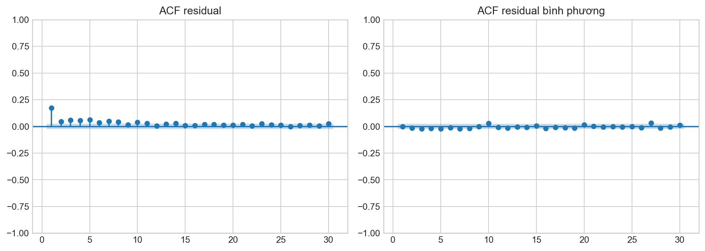

Squared-residual Ljung–Box p=0.0768; giá trị thấp sẽ là bằng chứng volatility dynamics còn sót lại.

### Hình 12: 12_feature_importance

Ba feature impurity-importance cao nhất của return forest h=20 là current_drawdown, rolling_max_drawdown, drawdown_duration; importance không đồng nghĩa quan hệ nhân quả.

### Hình 13: 13_grouped_permutation_importance

Grouped permutation được tính trên test với 3 lần lặp; top feature riêng lẻ có permutation delta -0.001706 theo negative MAE.

### Hình 14: 14_partial_dependence

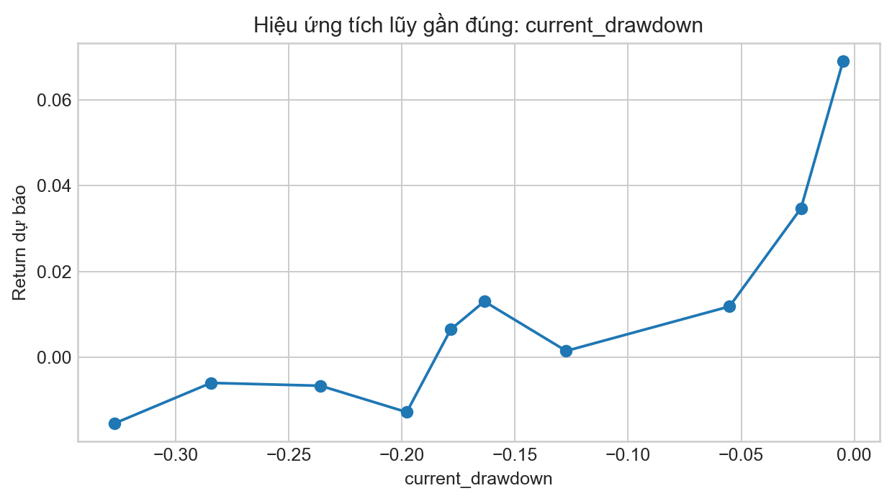

Đường binned effect dùng feature current_drawdown; đây là quan hệ dự báo có điều kiện, không phải tác động nhân quả.

### Hình 15: 15_confusion_matrix

H=20 chọn λ hướng=0.75, λ stress=1.60; test có 55 Bear và 218 Stress, recall=0.00%/0.00%.

### Hình 16: 16_reliability_diagram

Calibration h=20 chọn isotonic; test ECE=0.0336, slope=0.130, intercept=-0.068.

### Hình 17: 17_actual_predicted_return

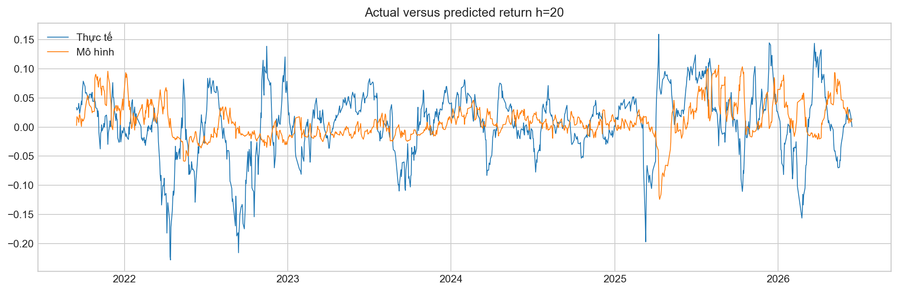

H=20 RMSE return=0.057330, correlation=0.000, directional accuracy=59.39%.

### Hình 18: 18_actual_predicted_price

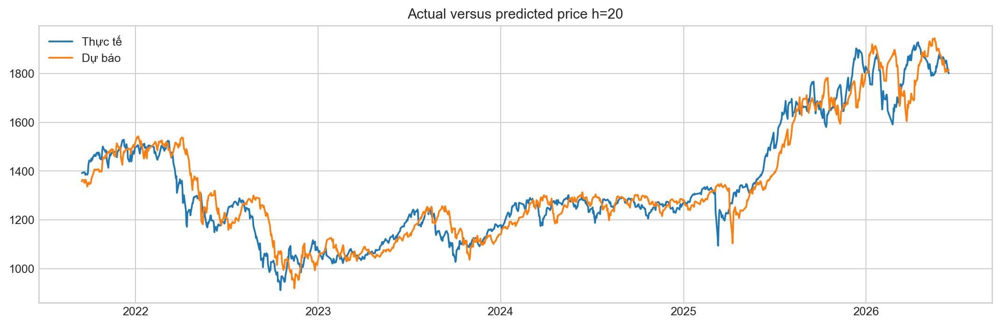

H=20 MAE price=57.41, RMSE price=77.91, sMAPE=4.28%.

### Hình 19: 19_rolling_error

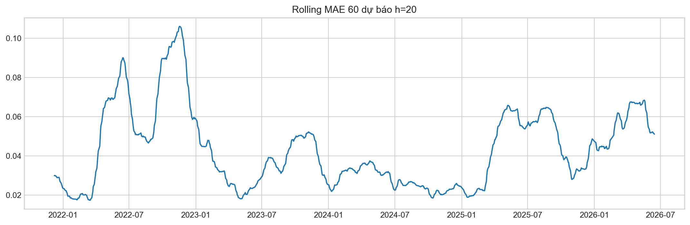

Mean signed error h=20=0.3478%; rolling MAE cho thấy sai số tập trung theo giai đoạn thay vì ổn định hoàn toàn.

### Hình 20: 20_model_comparison

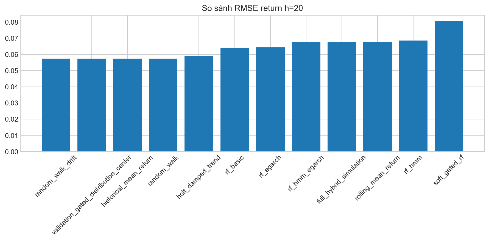

Ở h=20, RMSE thấp nhất thuộc random_walk_drift (0.057330). Chưa có đủ bằng chứng để kết luận mô hình chính tốt hơn baseline mạnh nhất; ở h=20, random_walk_drift có RMSE 0.057330.

### Hình 21: 21_interval_coverage_width

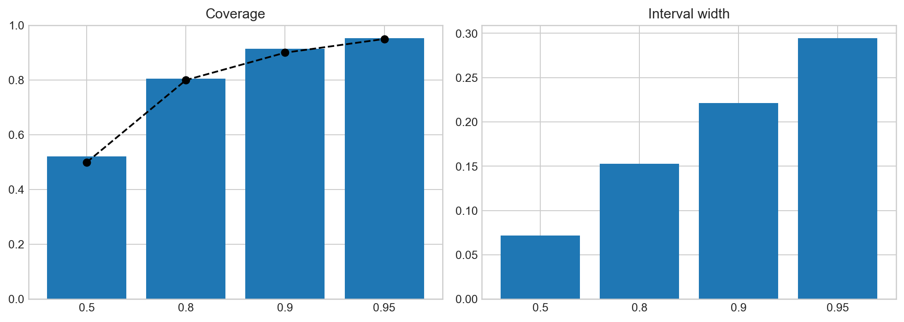

Mức 95% gần nominal nhất nhưng coverage=95.26%, error=+0.26%, width=0.2944.

### Hình 22: 22_diebold_mariano

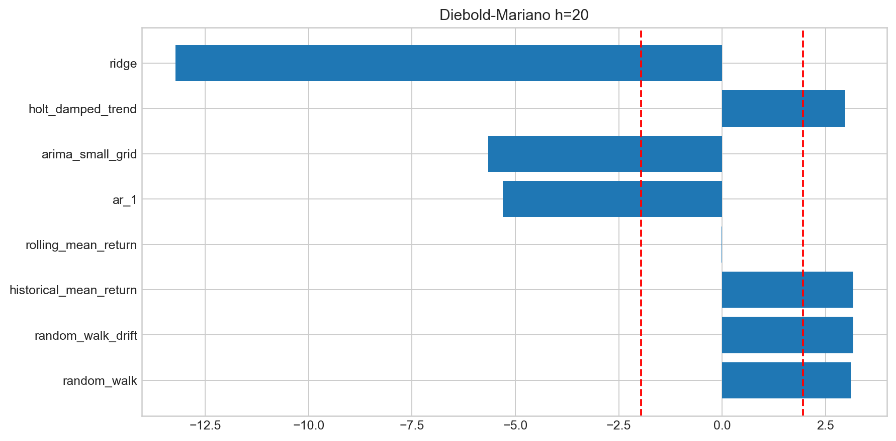

Có 22/48 phép DM thuận lợi và p<5% trước hiệu chỉnh multiple comparisons; điều này không đủ để thắng baseline mạnh nhất.

### Hình 23: 23_ablation_study

Ablation h=20 có Brier thấp nhất ở RF + HMM + EGARCH (0.6573); jackknife chỉ đo ổn định, không đổi point forecast.

### Hình 24: 24_monte_carlo_paths

Hình chỉ vẽ tối đa 100 path trong 40,000 path; mỗi path là kịch bản có điều kiện, không phải dự báo chắc chắn độc lập.

### Hình 25: 25_fan_chart

Median terminal 1826.41; interval 95% [1640.48, 2029.71], P(return âm)=39.66%.

### Hình 26: 26_forecast_quantiles

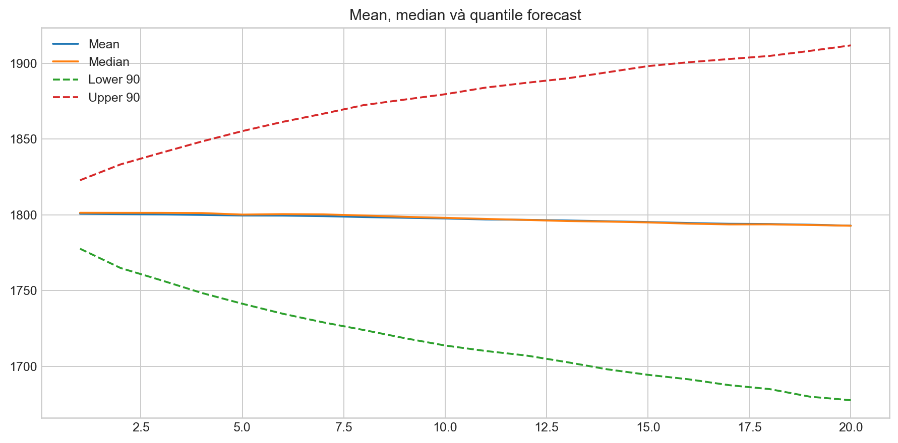

Terminal mean 1828.11 và median 1826.41; chênh 1.70 điểm phản ánh bất đối xứng nhỏ.

### Hình 27: 27_terminal_price_distribution

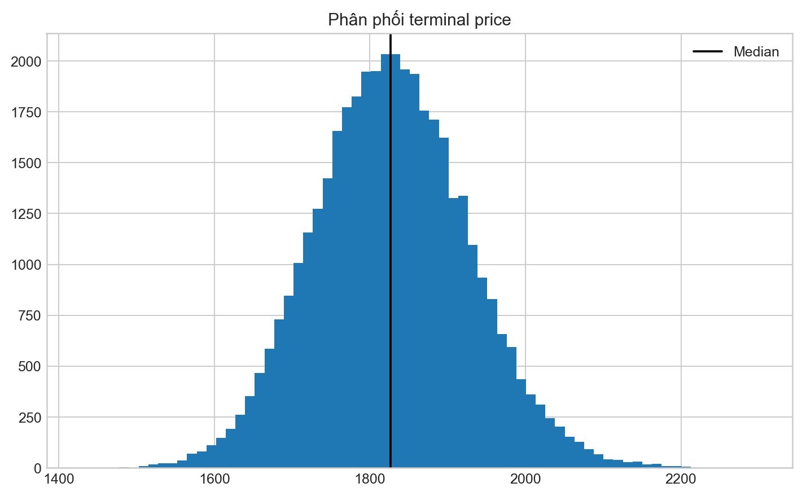

Terminal mean/median là 1828.11/1826.41; độ rộng interval 95% là 389.23 điểm.

### Hình 28: 28_terminal_return_distribution

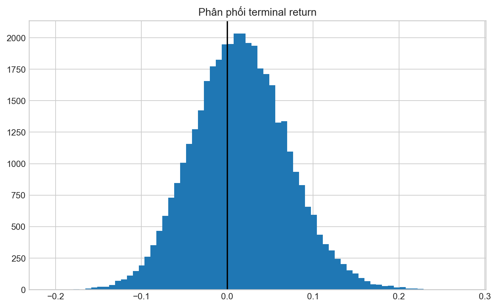

Expected/median terminal return là 1.53%/1.44%; P(tăng)=60.34%.

### Hình 29: 29_maximum_drawdown_distribution

Expected/median MDD là -4.52%/-3.98%; quantile xấu 5%=-9.43%.

### Hình 30: 30_var_expected_shortfall

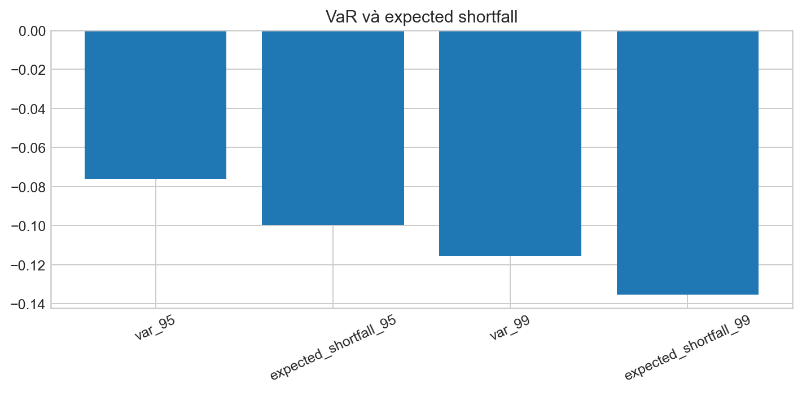

VaR 95%=-7.59%, ES 95%=-9.97%; backtest h=20 có exceedance 95%=4.74% (Kupiec p=0.677).

### Hình 31: 31_drawdown_probabilities

P(MDD vượt 3/5/7/10%) lần lượt 67.81%, 35.03%, 15.87%, 3.78%.

### Hình 32: 32_forecast_regime_probabilities

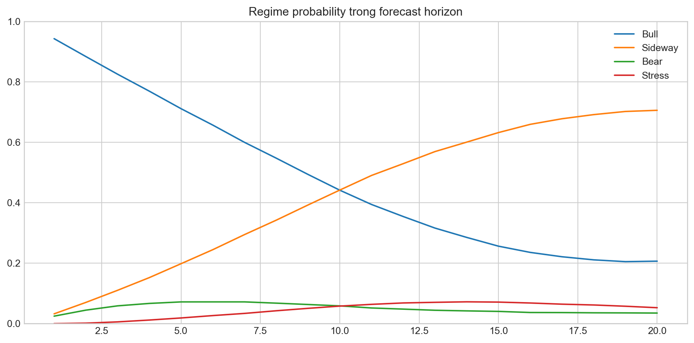

Ở bước 20, Bull/Sideway/Bear/Stress lần lượt 20.66%/70.58%/3.49%/5.26%.

### Hình 33: 33_simulation_comparison

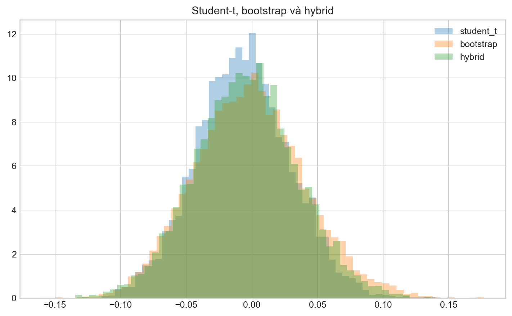

ES95 giữa Student-t/bootstrap/hybrid dao động từ -10.37% đến -9.67%; hybrid dùng student weight 0.35.

### Hình 34: 34_jackknife_sensitivity

Block nhạy nhất là leave_one_crisis_like_block_out_mae:brier_score với CI [0.5996, 0.7149]; run dùng record-level quick jackknife.

### Hình 35: 35_seed_stability

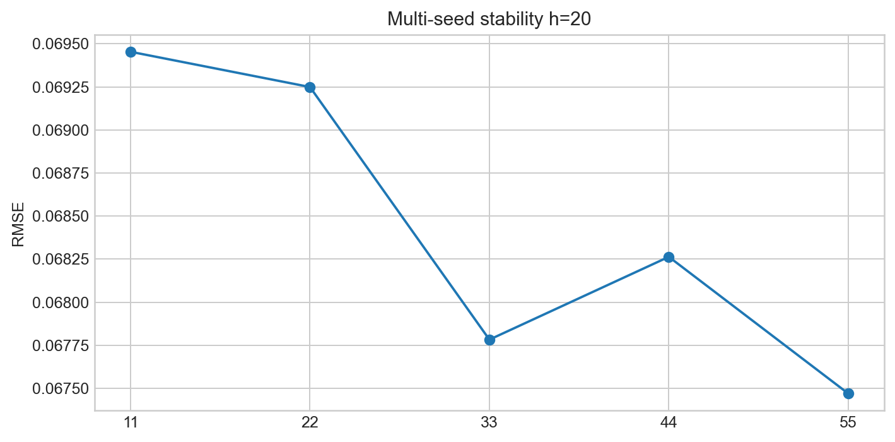

RMSE h=20 qua 5 seed nằm trong [0.067470, 0.069454], std=0.000879.

### Hình 36: 36_latest_forecast

Origin 2026-07-13; median return 1.44%, P(tăng/giảm)=60.34%/39.66%, P(MDD>5%)=35.03%.

### Hình 37: 37_before_after_coverage

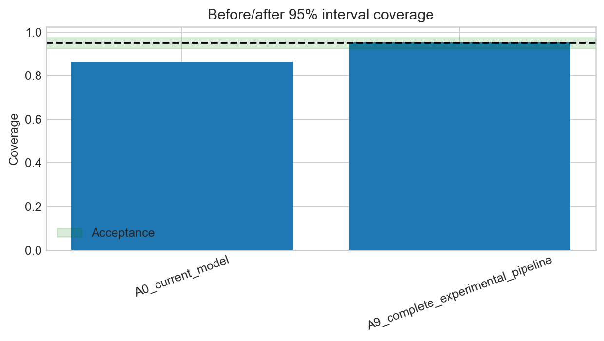

Coverage 95% tăng từ 86.29% lên 95.26%; thay đổi đi kèm width từ 0.2088 lên 0.2944.

### Hình 38: 38_coverage_width_frontier

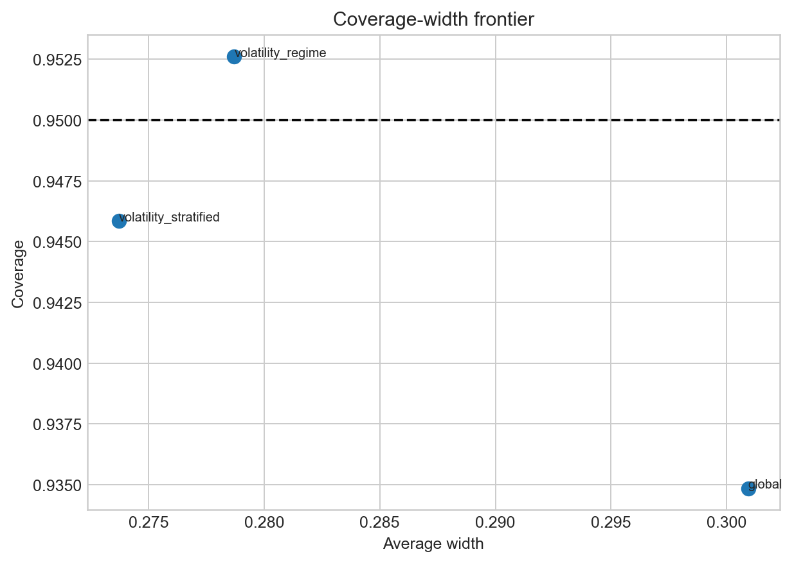

Frontier so sánh global, volatility và volatility×regime trên cùng test; phương pháp khóa từ validation là regime_stratified.

### Hình 39: 39_conformal_interval_score

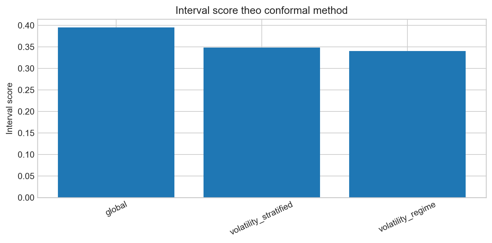

Interval score test thấp nhất trong ba ablation conformal là 0.3406; coverage không được tối ưu riêng lẻ.

### Hình 40: 40_sequential_conformal_multiplier

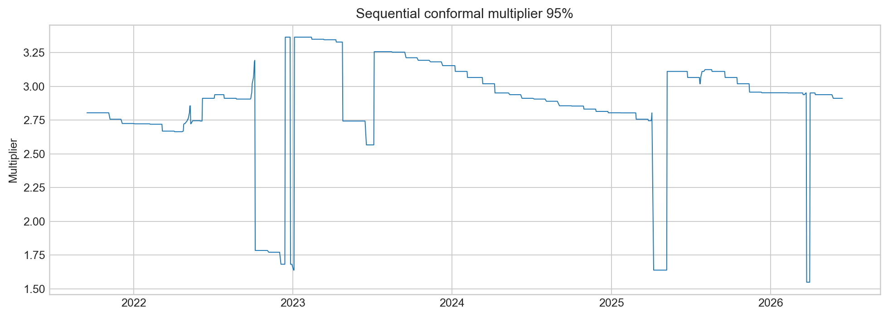

Multiplier chỉ cập nhật khi score h=20 đã mature; window/method được khóa trên validation, không chọn lại bằng test.

### Hình 41: 41_multiplier_by_volatility_stratum

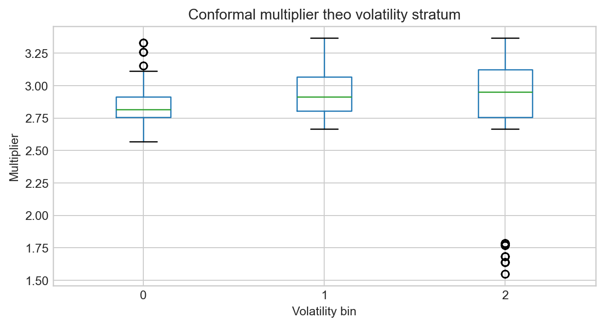

Phân bố multiplier khác nhau giữa các volatility bin; tầng thiếu mẫu fallback về volatility, regime rồi global.

### Hình 42: 42_var_exceedance_rolling

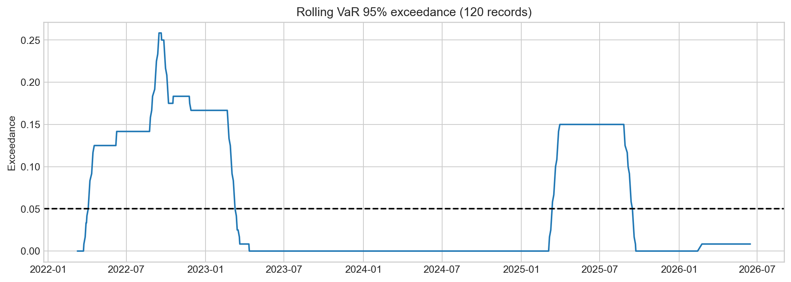

VaR 95% toàn test đổi từ 13.45% xuống 4.74%; rolling rate cho thấy calibration vẫn thay đổi theo thời gian.

### Hình 43: 43_mc_probability_convergence

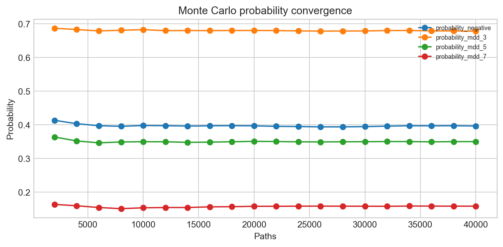

Adaptive simulation dừng với 40,000 paths và lý do maximum_paths; đường hội tụ là sai số số học, không phải predictive uncertainty.

### Hình 44: 44_mcse_by_paths

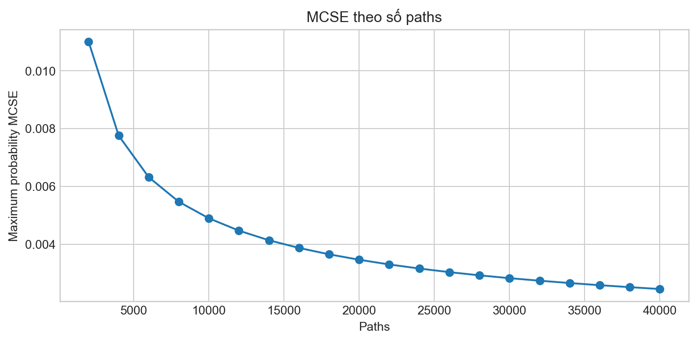

MCSE lớn nhất tại batch cuối nằm trong bảng adaptive_convergence.csv; tolerance chỉ kiểm soát Monte Carlo numerical error.

### Hình 45: 45_ess_by_proposal_strength

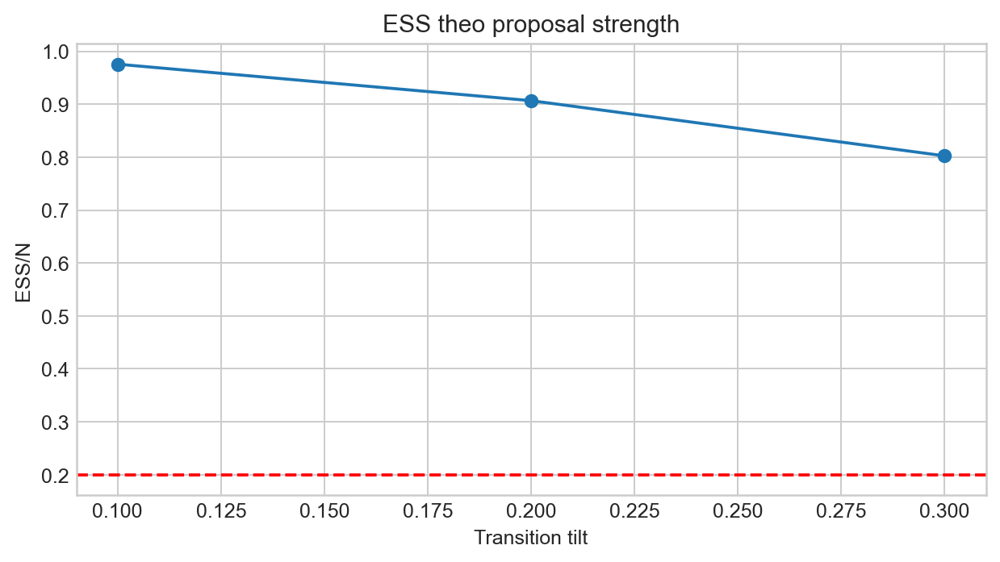

Proposal được chọn có ESS/N=80.24%; đường đỏ là ngưỡng chấp nhận 20%.

### Hình 46: 46_importance_weight_distribution

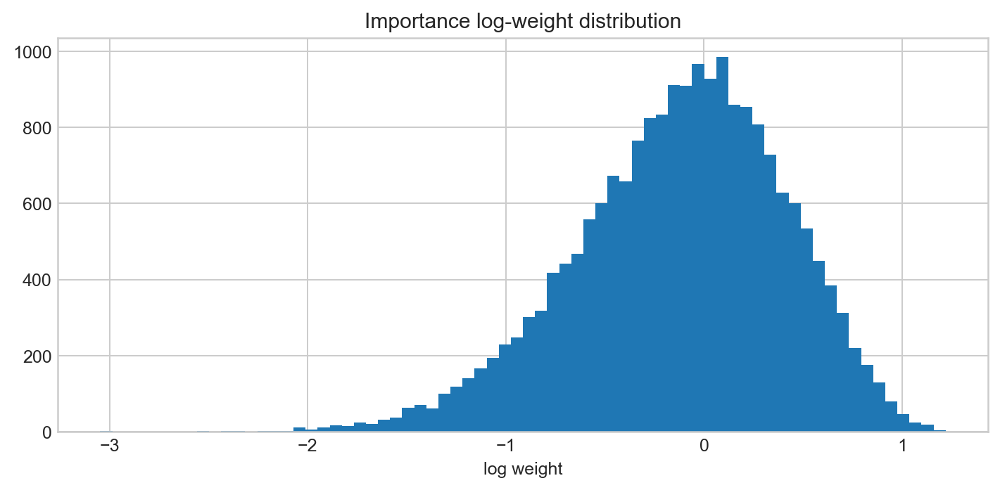

Max normalized weight=0.000168, CV weight=0.50; không clipping weight.

### Hình 47: 47_naive_vs_importance

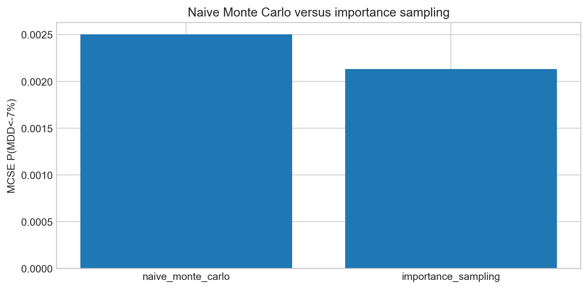

Variance-reduction ratio cho P(MDD<-7%) là 1.38x; importance sampling chỉ tăng hiệu quả estimator tail.

### Hình 48: 48_tail_event_count

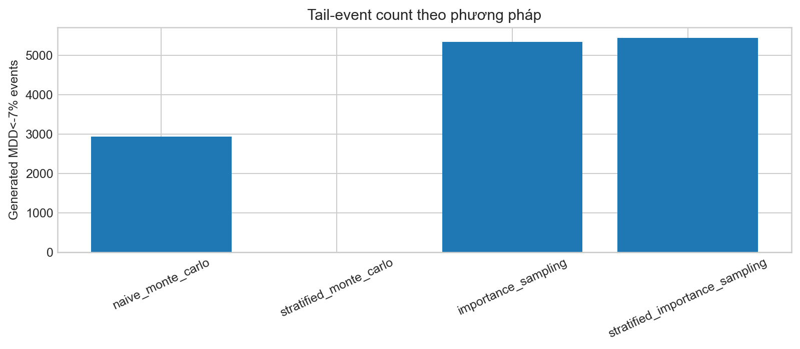

Importance proposal sinh 5348 path MDD<-7%; estimator cuối vẫn dùng likelihood ratio về xác suất thật.

### Hình 49: 49_outer_bootstrap_uncertainty

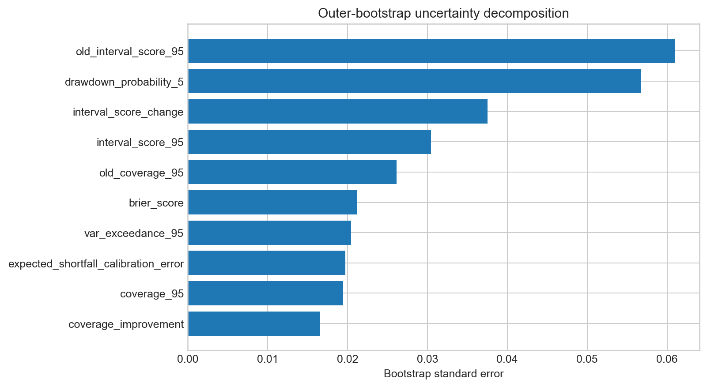

Outer quick bootstrap dùng 2000 stationary-block replications; đây là parameter/record uncertainty approximation, không phải inner residual bootstrap.

### Hình 50: 50_delete_block_jackknife_influence

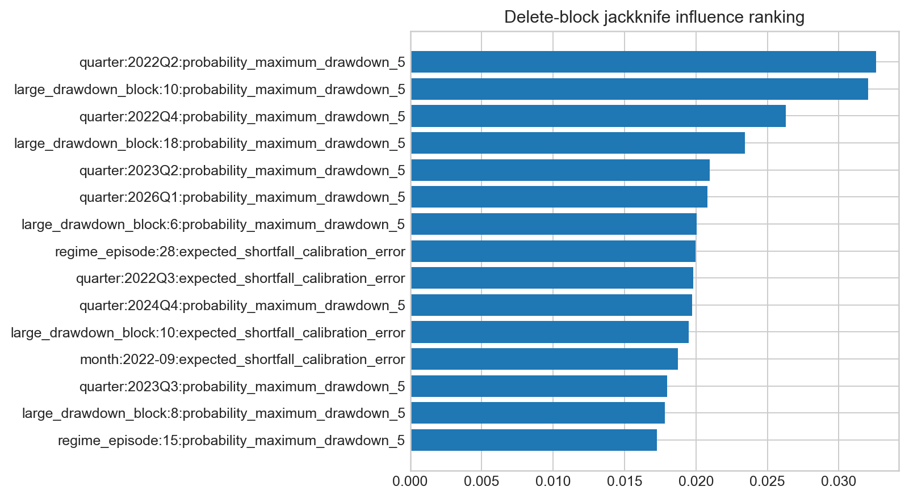

Influence lớn nhất là quarter 2022Q2 cho probability_maximum_drawdown_5, |delta|=0.0326.

### Hình 51: 51_validation_alpha_blend

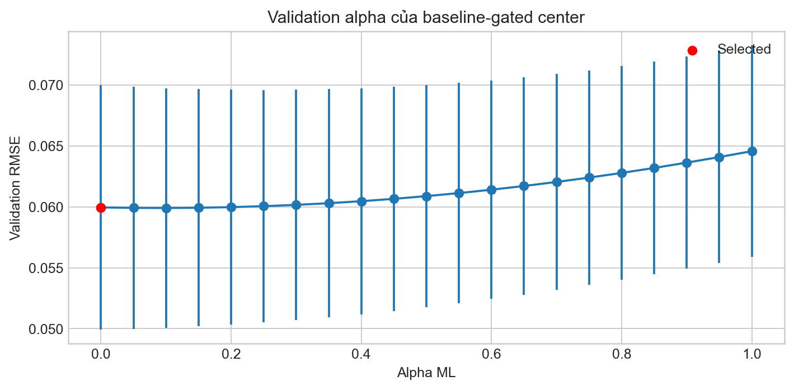

Alpha h=20 được khóa ở 0.00; lý do: fallback: validation improvement 0.0802% < minimum 1.0000%.

### Hình 52: 52_advanced_ablation

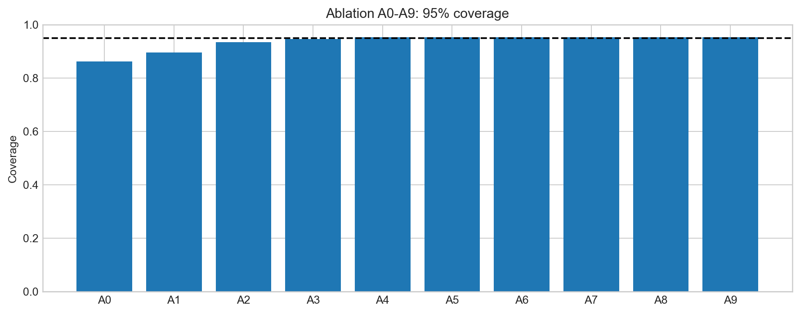

A0-A9 dùng cùng test records; cải thiện coverage không được diễn giải là predictive signal mới.

### Hình 53: 53_current_vs_improved_same_test

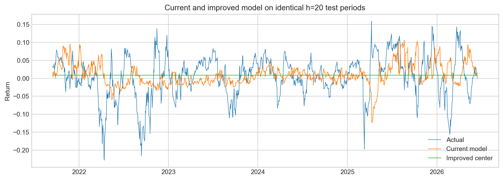

RMSE cùng test đổi từ 0.067470 xuống 0.057330; gated center là cơ chế bảo vệ khi ML không vượt baseline trên validation.

## 12. Khả năng ứng dụng và hạn chế

Kết quả phù hợp cho stress testing và tham khảo phân phối có điều kiện, không phải khuyến nghị đầu tư. Giới hạn gồm structural break, proxy lịch giao dịch, sai số ước lượng HMM/EGARCH, sparse Stress class, calibration drift và giả định shock lịch sử còn đại diện. Không đánh đồng accuracy trạng thái với lợi nhuận chiến lược.

## 13. Hướng phát triển

Mở rộng nested model-refit bootstrap, calendar HOSE chính thức, covariate vĩ mô có timestamp kiểm chứng, conformal intervals theo regime và đánh giá live forward không tái sử dụng test.

## 14. Dự báo rủi ro đường đi và drawdown

Drawdown return giữ dấu âm để tương thích; toàn bộ bảng mới dùng `drawdown_severity=-drawdown_return>=0`. Origin-peak đo khoản giảm mới từ forecast origin, còn historical-peak giữ đỉnh lịch sử nên bắt đầu từ drawdown hiện tại. Terminal return dương vẫn có thể đi cùng intra-horizon drawdown lớn.

MDaR là quantile của maximum drawdown severity, khác VaR terminal return. CED là severity trung bình phía trên MDaR, khác expected shortfall của return. Monte Carlo confidence interval đo sai số số học của probability estimator; predictive/conformal bound đo bất định của outcome. Direct drawdown conformal có backtest coverage riêng và chỉ dùng score đã mature.

Origin-peak MDaR90/95/99 là **8.04%/9.43%/12.36%**; CED90/95/99 là **9.95%/11.23%/13.93%**. Historical-peak recovery probability là **22.00%**. Drawdown acceptance đạt **8/9**; nếu thiếu một guardrail, module tiếp tục experimental.

Stress scenario không phải xác suất dự báo. Importance sampling giảm phương sai estimator rare event nhưng không làm drawdown dễ dự báo hơn.

## 15. Biểu đồ drawdown

### 54_drawdown_fan_chart_origin_peak

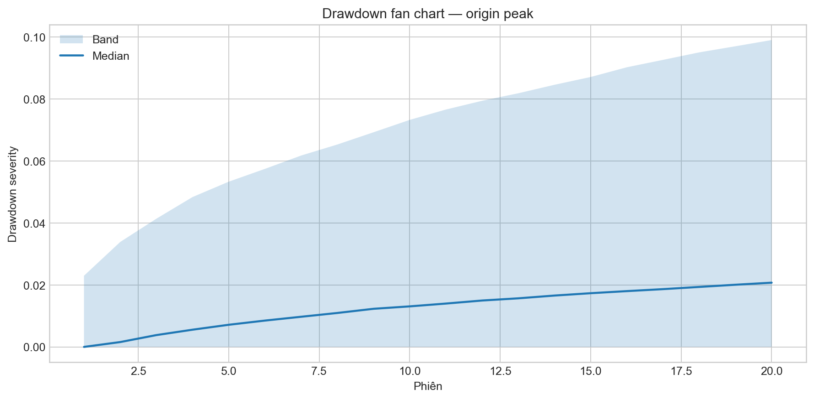

Origin-peak median ending severity 2.07%; MDaR95 9.43%.

### 55_drawdown_fan_chart_historical_peak

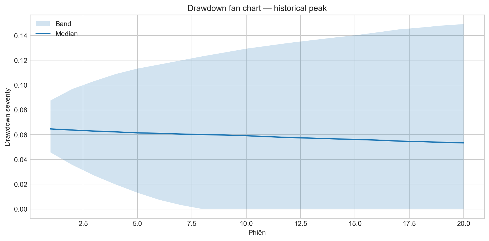

Historical-peak median ending severity 5.33%; anchor bắt đầu từ drawdown hiện tại.

### 56_running_maximum_drawdown_fan_chart

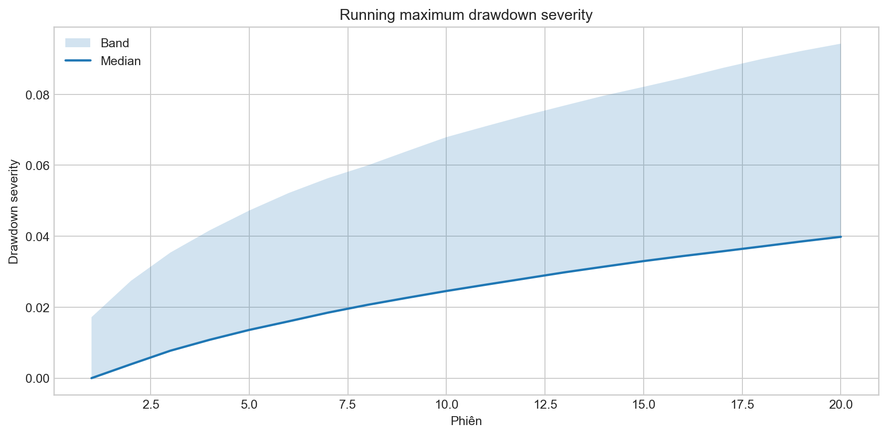

Running maximum severity không giảm theo thời gian; khác drawdown tức thời có thể phục hồi.

### 57_drawdown_breach_probability_term_structure

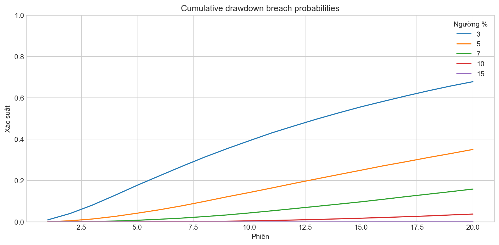

P(breach 3/5/7/10%) cuối horizon: 67.81%/35.03%/15.87%/3.78%.

### 58_first_passage_time_distribution

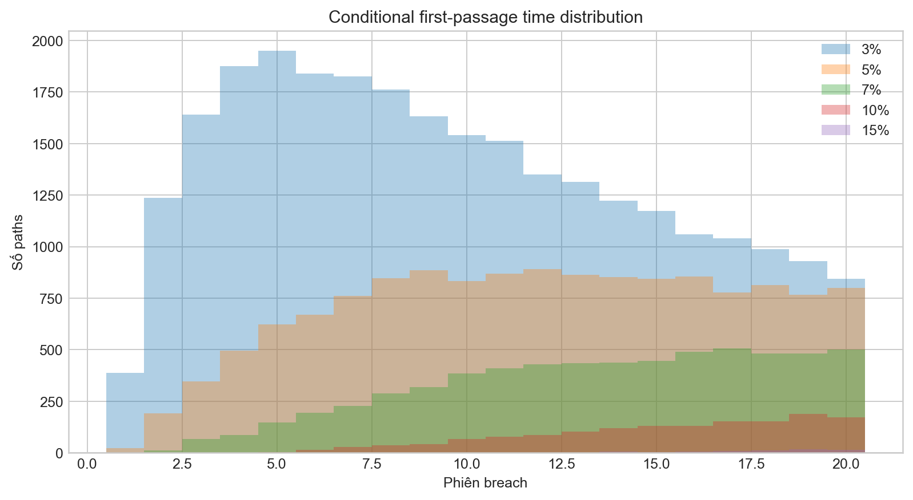

First-passage time chỉ thống kê trên path đã breach; path chưa breach được giữ right-censored.

### 59_mdar_ced_term_structure

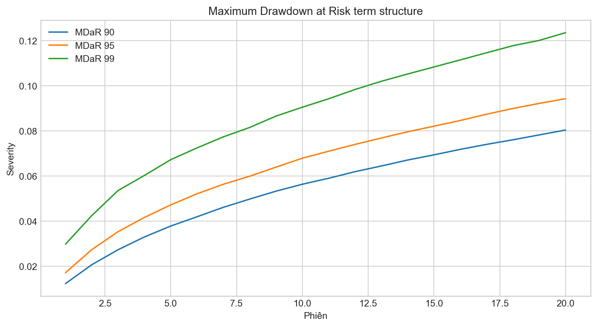

MDaR90/95/99: 8.04%/9.43%/12.36%; CED95 11.23%.

### 60_recovery_probability_curve

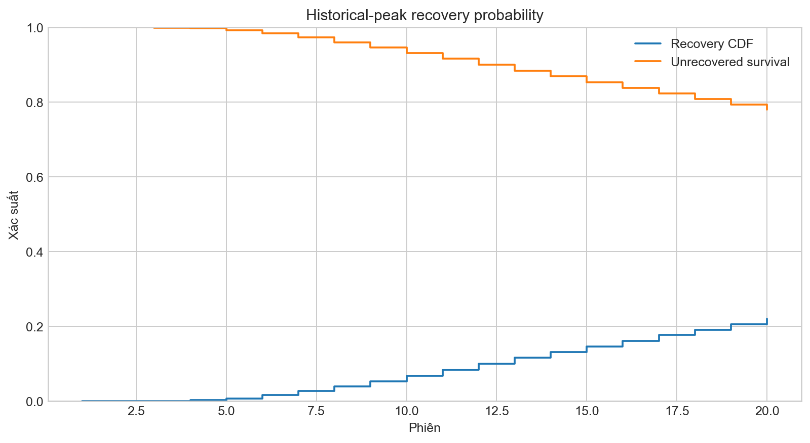

Xác suất phục hồi historical peak trong horizon là 22.00%.

### 61_drawdown_probability_reliability

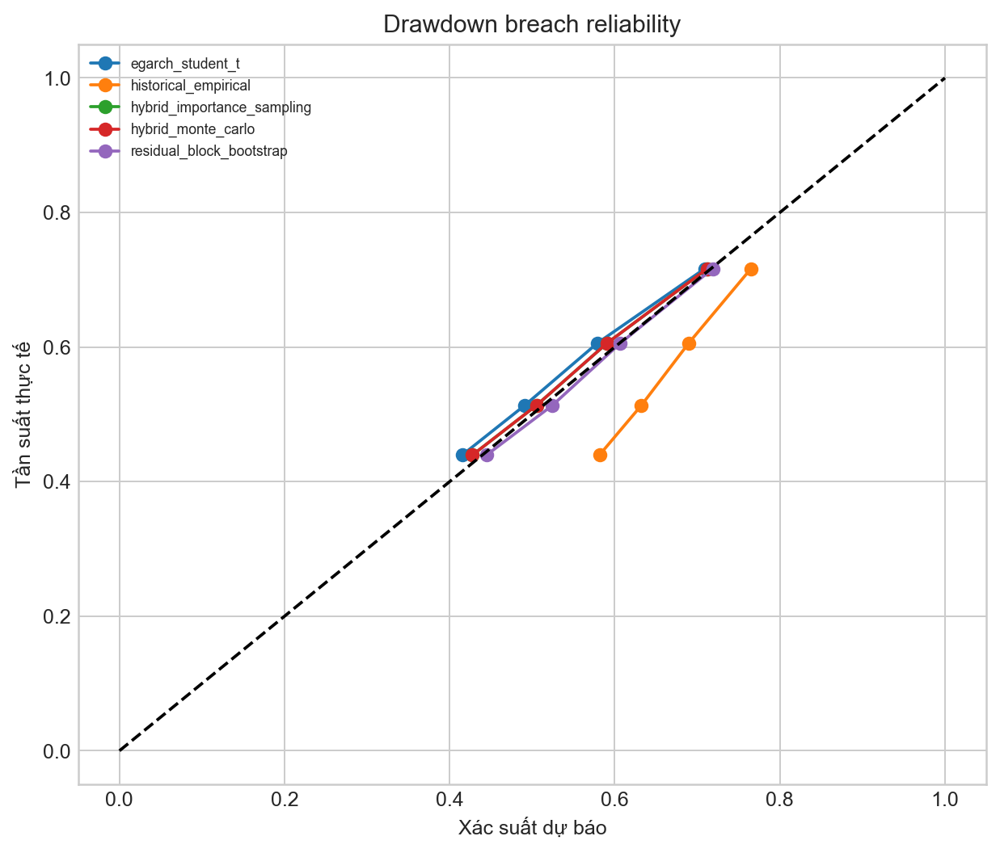

Brier tốt nhất trên bảng backtest là 0.0000; reliability gap được báo cáo riêng theo threshold.

### 62_realized_vs_predicted_drawdown

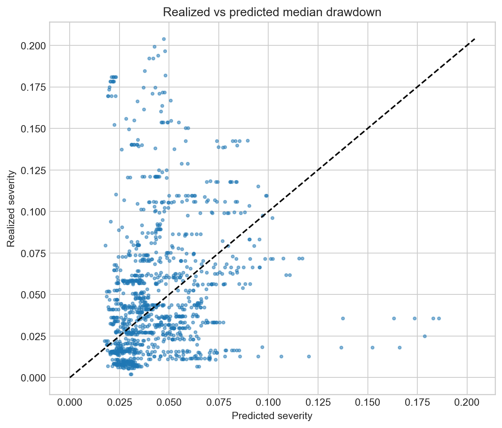

Predicted median drawdown và realized drawdown được so trên cùng OOS origins; dispersion lớn phản ánh rủi ro đường đi khó dự báo.

### 63_drawdown_upper_bound_coverage

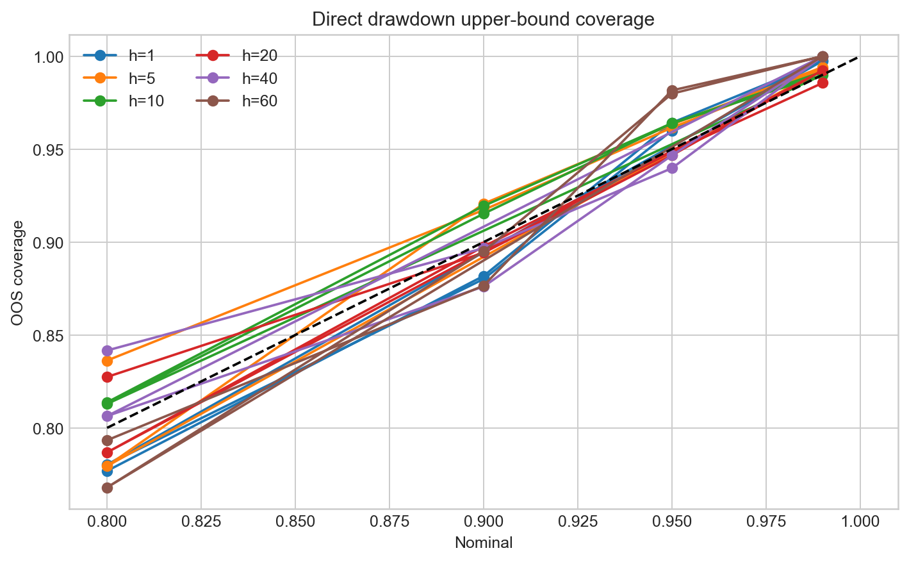

Direct drawdown conformal được chọn trên validation, không tái dùng return-conformal multiplier.

### 64_pointwise_vs_simultaneous_drawdown_band

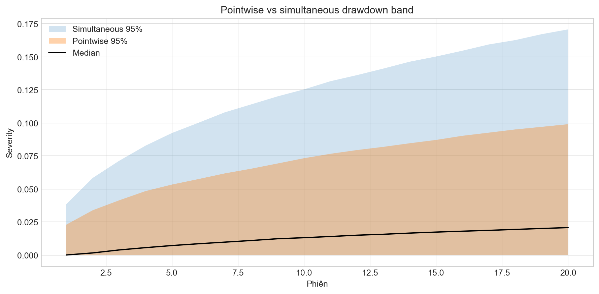

Simultaneous band nhắm bao phủ cả trajectory nên rộng hơn pointwise band.

### 65_origin_vs_historical_peak_drawdown

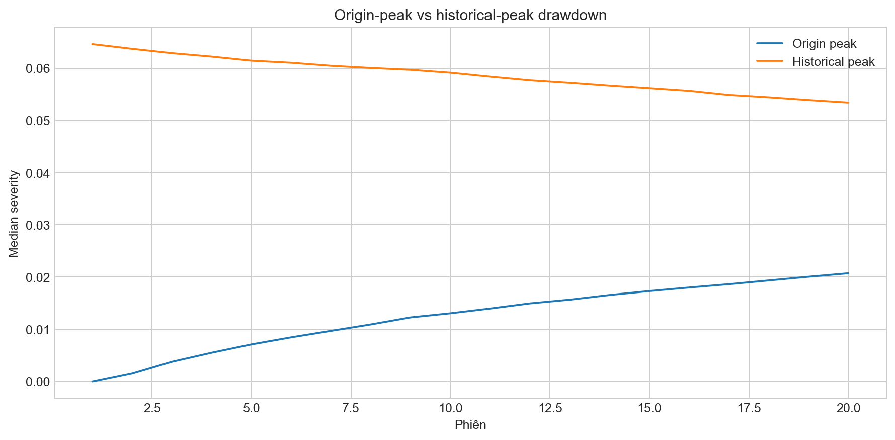

Historical-peak severity có thể cao ngay ở bước đầu vì không reset drawdown tại forecast origin.

### 66_drawdown_mcse_by_paths

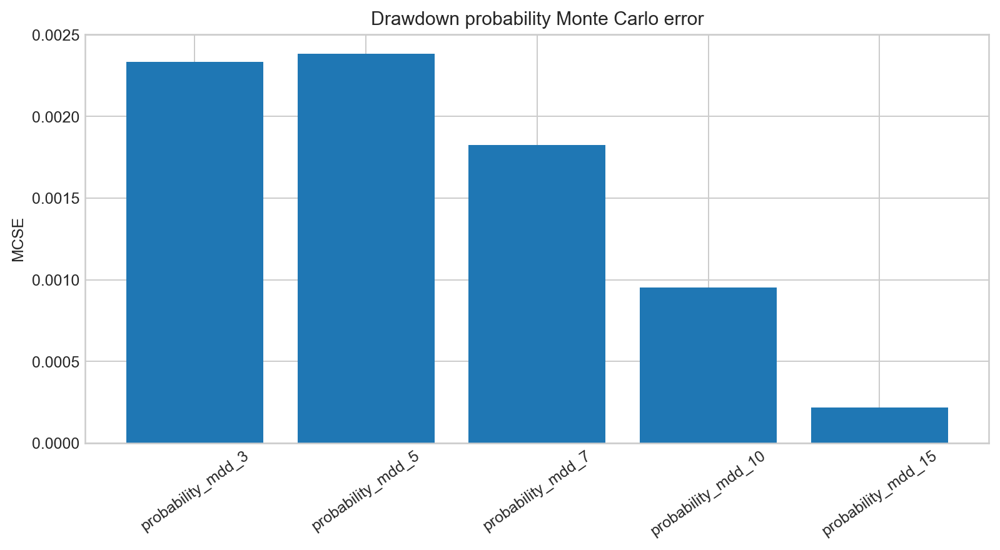

MCSE lớn nhất trong các breach statistic là 0.0024; đây là numerical error, không phải predictive interval.

### 67_drawdown_importance_sampling_efficiency

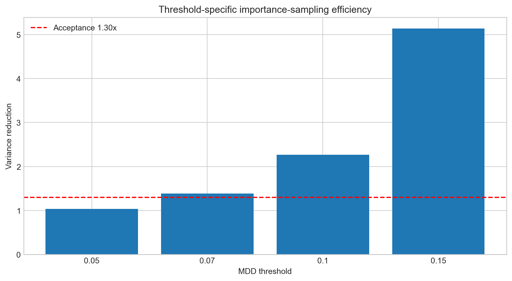

Proposal được chọn theo từng threshold; variance reduction tốt nhất 5.13x.

### 68_drawdown_scenario_risk_cone

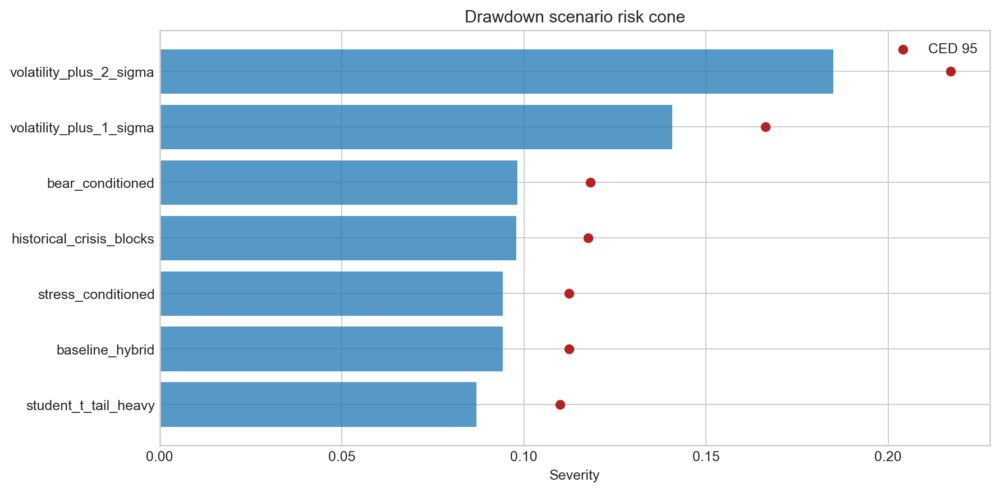

Stress scenarios là conditional what-if và không được trộn với xác suất baseline_hybrid.

### 69_drawdown_duration_distribution

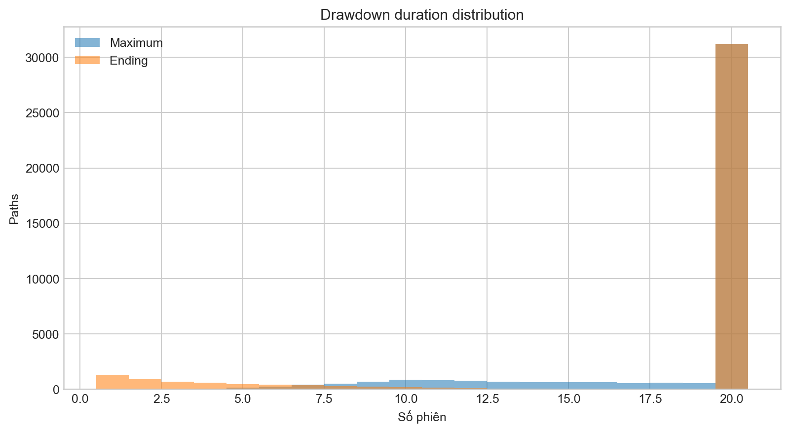

Duration giữ recovery time NaN cho path chưa phục hồi, thay vì ép bằng horizon.

### 70_drawdown_calibration_by_regime

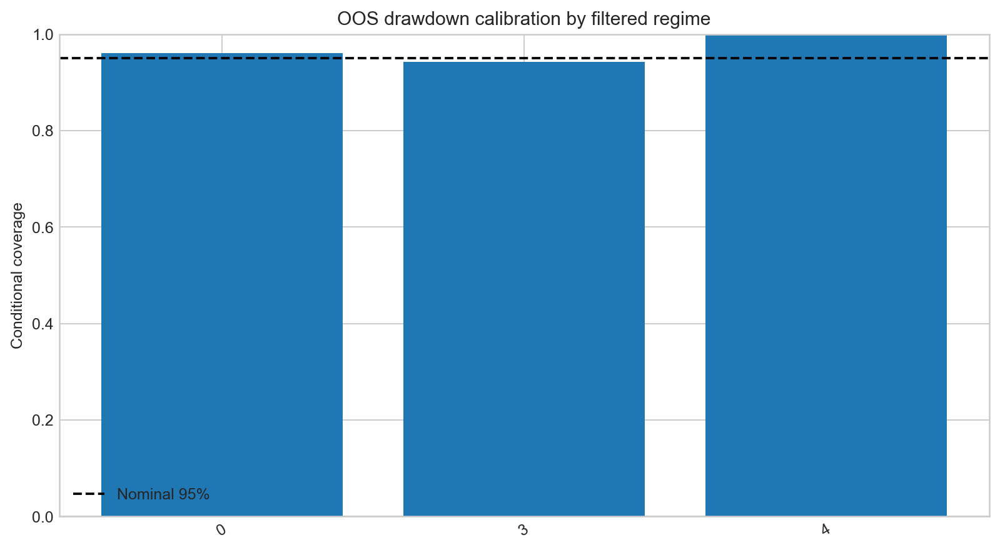

Calibration strata thiếu mẫu fallback về global; method được khóa bằng validation objective.
